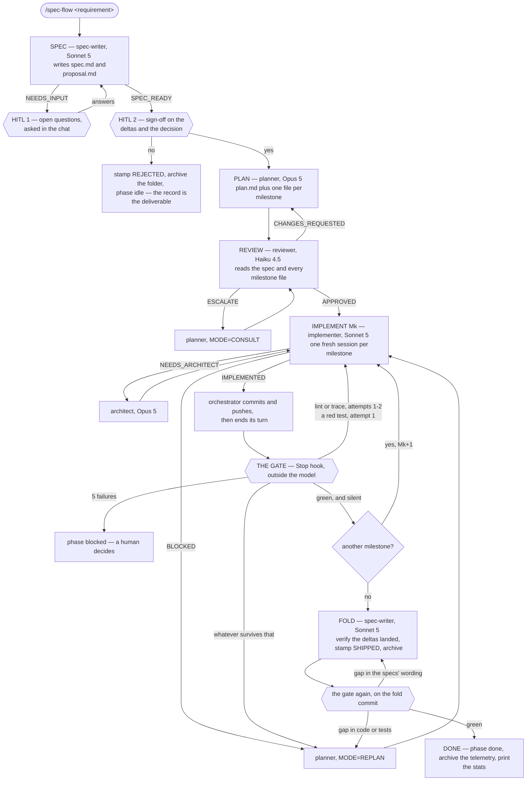
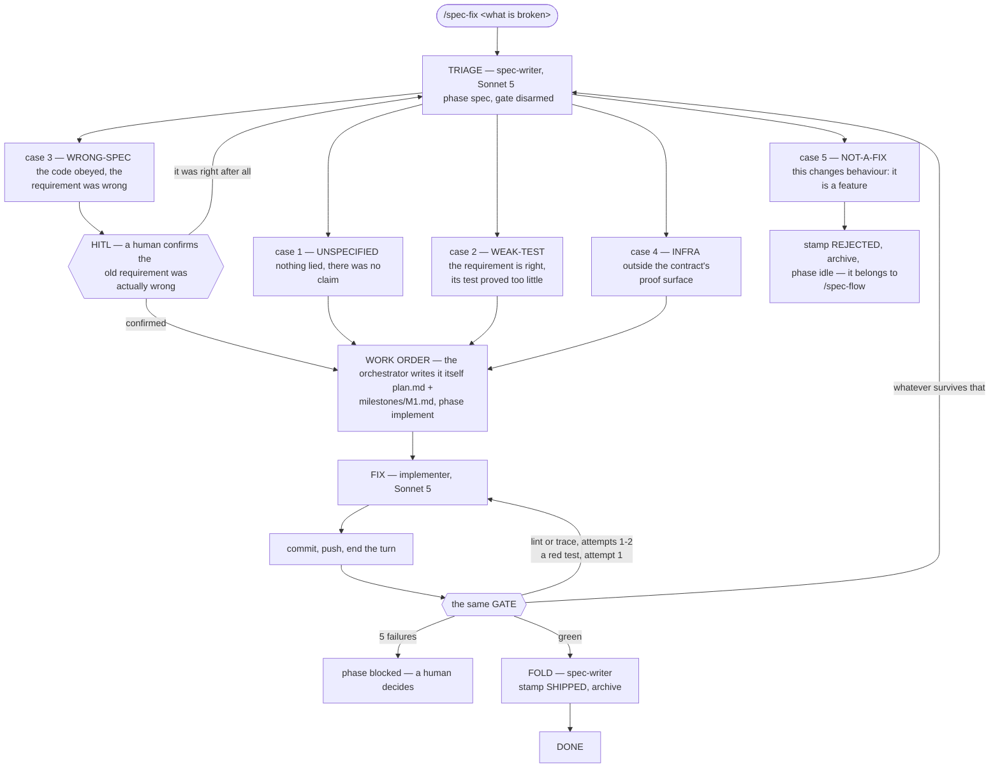

# spec-flow

A spec-driven multi-agent pipeline for Claude Code. A free-text requirement
becomes a spec you sign off on, a milestone-by-milestone plan, a review pass,
and an implementation loop gated by lint, tests and requirement traceability
running **outside the model**.

Two commands — `/spec-flow` for a feature, `/spec-fix` for a defect — drive
five subagents, each pinned to the model its job needs. The engine has no
opinion about your language, framework or architecture: that lives in one file
your repo writes, `.spec-flow/config.json`.

---

## Requirements

- Claude Code, and a git repo with a base branch you branch off of
- Node 20+
- A linter and a test runner you can invoke from the command line

## Install

**1. Install the plugin.**

```bash
claude marketplace add IgnacioMarin402/spec-flow-plugin
claude plugin install spec-flow@spec-flow-marketplace
```

**2. Install the CLI too.** The hooks reach the engine through
`${CLAUDE_PLUGIN_ROOT}`, which only exists inside a Claude Code session. Your
terminal and CI need the same checks:

```bash
npm install --save-dev github:IgnacioMarin402/spec-flow-plugin
```

```json
{
  "scripts": {
    "check": "spec-flow check",
    "spec:check": "spec-flow trace",
    "flow:stats": "spec-flow stats"
  }
}
```

The hook and these aliases run the **same file**, so "same files, same
commands, same result" is structural rather than two copies that agree today.

**3. Write the contract** at `.spec-flow/config.json` — see below. Start from
[`examples/`](examples/).

**4. Create the directories.** The engine writes entries under them; it does
not create them.

```bash
mkdir -p specs specflow/archive
echo '.claude/state/' >> .gitignore
```

`specs/` holds capability specs, one per module, each starting with
`<!-- spec-scope: <path> -->`. `specflow/` holds live change folders,
`specflow/archive/` the finished ones.

**5. Verify.**

```bash
node node_modules/spec-flow-plugin/scripts/spec-flow-config.mjs
```

It prints the contract as the engine reads it, or names exactly what is
missing. A contract that does not load stops the run at the first gate, so
check it here instead.

---

## The contract

Everything the engine needs to know about your repo. Missing or malformed
stops the run with a message naming what to add — there is no fallback that
guesses a test runner or a proof directory for a repo it has never seen.

### `verify`

| key | required | what it is |
|---|---|---|
| `scope_globs` | yes | Which files count as in-scope, e.g. `["*.ts"]` |
| `lint` | yes | argv that lints, autofix on. Receives changed file paths appended |
| `lint_no_fix` | yes | Same, report only. Used by `spec-flow check --no-fix` |
| `test` | yes | argv that runs the suite. Invoked with **no** extra arguments |
| `test_name` | yes | Names the runner in log sections, e.g. `"vitest"` |
| `lint_name` | yes | Names the linter in log sections |
| `lint_config_hint` | yes | Where your lint rules live, quoted back when a rule fires |
| `base_ref` | no | The ref this branch is judged against. Omit to auto-resolve |

### `trace`

| key | required | what it is |
|---|---|---|
| `specs_dir` | no | Where capability specs live. Default `specs` |
| `proof_dir` | yes | Directory segment that marks a test as proof, e.g. `test` |
| `proof_suffix` | yes | Test filename suffix, e.g. `.test.ts` |
| `not_a_capability` | no | Filenames under `specs_dir` that are not specs. Default `["README.md", "glossary.md"]` |

`proof_dir` and `proof_suffix` do two jobs: they are what `spec-trace`
searches, **and** where the planner and implementer are told to put a new
test. An agent that writes its test elsewhere produces a requirement that
reads as unproven and a gate that blocks on a test which exists and passes.
Set them to where your tests actually live.

### `extra_checks`

Your own project checks, run at every gate and again at `done`. Each entry:

| key | required | what it is |
|---|---|---|
| `name` | yes | Shown in gate output |
| `cmd` | yes | argv, e.g. `["node", "scripts/my-check.mjs"]` |
| `field` | yes | The key it writes in `gate-history.log` |
| `green` | no | Line printed when it passes |
| `hint` | no | Appended to the block message when it fails |
| `class` | no | `"lint/trace"` (route as an edit, default) or `"behaviour"` (route as a re-plan) |

A check whose `cmd` names a repo-local script you have not written yet is
skipped, not failed — a repo mid-adoption is not blocked by its own pending
check. A check that names a binary or inline code is always run.

### `unscoped_denied`

What the engine redirects when an agent tries to run the whole suite
mid-milestone instead of the scoped form.

| key | what it is |
|---|---|
| `scripts` | Package scripts denied while implementing, e.g. `["test", "lint"]` |
| `tools` | Binaries denied directly, e.g. `["vitest", "eslint"]` |
| `scoped_allowed` | Scripts that stay allowed, e.g. `["check"]` |
| `scoped_alternative` | What to run instead, quoted in the denial |
| `scoped_examples` | Concrete allowed invocations, shown in the denial |

This is a consistency guard, not a security boundary — it is evadable and
says so in its own source. It exists to keep whole-suite output out of an
agent's context, not to stop a determined agent.

### Four rules the contract cannot express

**`.claude/state/` must be gitignored.** The gate writes there on every run.
Tracked, the tree is never clean again and the gate's quiescence guard skips
every run after the first — forever, silently. The gate filters that path out
of its own dirty check as a second line of defense; gitignoring it is what
keeps `git status` legible.

**Do not add `--passWithNoTests`** (or any equivalent) to `verify.test`. A
flag that makes an empty run exit 0 makes *every* run that matches nothing
exit 0 — a green gate over zero executed tests.

**`verify.test` must finish inside 1800s.** The gate is a `command` hook on
`Stop`; a hook that hits its timeout is canceled, renders no decision, and a
Stop hook with no decision **allows the stop** — no block, and no line in
`gate-history.log` either. If your suite can approach thirty minutes, declare
a smoke subset here and leave the exhaustive run to CI.

**The engine assumes a feature-branch workflow.** Scope is the merge-base diff
with your base branch, so work committed directly onto the base branch has an
empty scope and `verify.lint` has nothing to run on. The suite and the
unscoped checks still run.

### The base branch

Resolved in this order: `verify.base_ref`, then `refs/remotes/origin/HEAD`,
then `origin/main`, `main`, `origin/master`, `master`, `origin/develop`,
`develop`, `origin/trunk`, `trunk`. If none resolves, the gate **blocks** and
names the field to add.

It does not fall back, because the only available fallback — comparing HEAD
against itself — yields an empty changed-file list, which is indistinguishable
from "this milestone touched nothing". Declare `base_ref` for a release
branch, a fork's upstream, or a shallow CI checkout that fetched no other ref.

### The second config file

One setting lives outside the contract, at `.claude/spec-flow.config.json`:

```json
{ "max_opus_calls": 6 }
```

It caps planner + architect calls per run and defaults to 6. When it runs out
the spawn is denied and the orchestrator is told to summarize for a human —
which is what the budget is for. The counter is `.claude/state/opus_calls`.

### Project skills

The agents ship with **no** `skills:` frontmatter, and cannot have one:
preloading names specific skills, and a skill encodes how one codebase is
built. Instead, `implementer` and `planner` carry the `Skill` tool and read
`.spec-flow/skills.md` — a decision→skill table your repo writes — loading
what it routes them to on demand.

Write that file if your repo ships skills; skip it if not. To get preloading
back, add your own `agents/implementer.md` with a `skills:` line. Whether a
project-level agent cleanly overrides a plugin-shipped one of the same name is
not verified here — check before relying on it.

---

## Your first run

```
/spec-flow users can reset their password by email
```

What happens:

1. **The spec-writer asks you questions** if the requirement is ambiguous.
   Answer in the chat.
2. **You sign off.** It shows the requirement deltas and the decision, and
   waits. This is the last moment "no" costs nothing. A rejection is stamped
   and archived, not deleted.
3. **Plan, review, then implementation** — one milestone at a time, each in a
   fresh implementer session, test-first per requirement.
4. **The gate runs when the turn ends.** Green allows the stop; red blocks and
   tells the orchestrator what to fix.
5. **Fold and done.** The change spec is verified against `specs/`, stamped
   SHIPPED, archived with the run's telemetry.

**A pass is silent.** The gate allows the stop and prints nothing, so nothing
wakes the orchestrator back up. Both commands schedule a self check-in when
the session provides a scheduling tool; where it does not, a green milestone
waits for your next message. **A run that looks stalled after a milestone is
usually a run that passed** — say "continue".

If it stops and asks for a human, read `.claude/state/gate-failure.log`.

---

## Reference

### Commands and agents

| | |
|---|---|
| `/spec-flow <requirement>` | Full pipeline: spec, plan, review, implement, fold |
| `/spec-fix <what's broken>` | Defect flow: triage, one implementer pass, same gate |
| agents | `spec-writer` (Sonnet), `planner` (Opus), `reviewer` (Haiku), `implementer` (Sonnet), `architect` (Opus) |

### CLI

| command | what it does |
|---|---|
| `spec-flow check` | Lint changed files + full suite + unscoped checks. `--no-fix` to report only |
| `spec-flow trace` | `spec-trace` alone: the requirement/proof binding |
| `spec-flow stats` | Report over live and archived telemetry. `--raw` dumps the timeline |
| `spec-flow telemetry --mark` | Record the telemetry offset at the start of a run |
| `spec-flow telemetry <SLUG>` | Archive this run's slice into the change folder |

The orchestrator runs `telemetry` itself at intake and at DONE. Without it the
logs stay in gitignored state and `stats` has nothing to read.

### Hooks

| hook | event | fires on | what it does |
|---|---|---|---|
| `session-start` | `SessionStart` | — | Resets a phase left at `implement`/`blocked` for 6h+ to `idle` |
| `no-gate-cmds` | `PreToolUse` | `Bash` | Denies whole-repo lint/test runs while implementing |
| `done-guard` | `PreToolUse` | `Bash`, `Write`, `Edit` | Denies an unearned `done` |
| `opus-budget` | `PreToolUse` | `Task`, `Agent`, `SendMessage` | Counts planner/architect calls, denies past the cap |
| `arm-gate` | `PreToolUse` | `Task`, `Agent`, `SendMessage` | Writes `implement` when the implementer is engaged without it |
| `lint-on-write` | `PostToolUse` | `Write`, `Edit` | Lints the file just written, while it is still in context |
| `register-agent` | `PostToolUse` | `Task`, `Agent` | Maps session ids to agent types so `opus-budget` can charge a `SendMessage` |
| `run-trace` | `PostToolUse` | `Write`, `Edit`, `Read`, `Bash`, `Task`, `Agent` | The run's observable timeline. Enforces nothing |
| `gate` | `Stop` | — | The external gate |

Only `gate`, `lint-on-write` and `no-gate-cmds` are armed exclusively by the
`implement` phase. `opus-budget`, `arm-gate` and `done-guard` stand down only
outside a run. `register-agent`, `run-trace` and `session-start` never enforce
anything.

### Phases

The spine of a run is `.claude/state/phase`. Every hook reads it to decide
whether it is armed.

| phase | written by | what it arms |
|---|---|---|
| `spec` | orchestrator, at intake | Opus budget, `done-guard`, `arm-gate` |
| `plan` | orchestrator | Opus budget, `done-guard`, `arm-gate` |
| `review` | orchestrator | Opus budget, `done-guard`, `arm-gate` |
| `implement` | orchestrator — or `arm-gate`, if it forgot | **the gate**, **lint-on-write**, **the command deny**, Opus budget, `done-guard` |
| `blocked` | **the gate itself**, at the attempt cap | Opus budget, `done-guard`, `arm-gate` |
| `done` | orchestrator, if `done-guard` allows | nothing |
| `idle` | orchestrator on rejection; `session-start` on an abandoned run | nothing |

**This vocabulary is a closed set — never extend it.** Every hook falls
through to "not my business" on a value it does not recognise, so inventing a
phase like `triage` runs the flow with the gate, the write-time linter, the
command deny and the Opus budget **all disarmed at once**, silently.

### `.claude/state/`

Gitignored working files. Delete any of them to reset that piece of state.

| file | what it holds |
|---|---|
| `phase` | The current phase. The spine of the run |
| `gate_attempts` | Consecutive gate failures. Reset on pass, capped at 5 |
| `opus_calls` | Planner + architect calls this run |
| `agent-registry` | Session id → agent type |
| `run-offset` | Telemetry line counts at intake, set by `telemetry --mark` |
| `gate-history.log` | One line per gate invocation. The audit trail |
| `run-trace.log` | Reads, writes, test verdicts, subagent outcomes |
| `gate-failure.log` | Last failure, truncated — what the planner reads |
| `gate-failure.full.log` | Same, untruncated — what a human reads |
| `lint-on-write-unmatched.log` | Linter invocations that failed to spawn |
| `run-trace-unmatched.log` | Subagent returns with no `STATUS:` line |
| `opus-budget-unmatched.log` | Payloads the budget could not attribute |
| `register-agent-unmatched.log` | Spawns whose session id was not found |

The four `*-unmatched.log` files are how each hook reports its own blind
spots. A hook that fails open silently is indistinguishable from one that had
nothing to do; these are what make the difference readable.

---

## How it works

Nothing coordinates a run but the phase file — no queue, no daemon, no shared
memory between agents. A subagent finishes, the orchestrator's turn ends, and
a `Stop` hook runs the checks outside the model and either allows the stop or
blocks with the instruction for what to do next.

- **The orchestrator never writes code.** It routes. Everything that produces
  an artifact is a subagent pinned to the model its job needs.
- **The gate is not a step in the pipeline** — it is what happens when the
  pipeline stops. Its block message *is* the next instruction.

### `/spec-flow` — a feature



Each milestone gets a **fresh** implementer session, but every follow-up
within that milestone goes back to the *same* session — a new session re-reads
the plan and every touched file from a cold context, and that repeated
re-reading across retries is where most of a run's token cost goes.

### `/spec-fix` — a defect

A feature is an open question about what the system should do. A defect is a
closed question: the system already claims a behaviour and something disagrees
with the claim, so the job is finding **which side is wrong**. That is triage,
not planning — which is why this flow drops the planner and the reviewer.



Only cases 3 and 5 stop for a human. Rewriting a requirement so it agrees with
the code is indistinguishable, from the diff alone, from rewriting it so it
agrees with the *bug*. A surviving failure goes back to **triage**, not to a
planner: a fix whose test will not go green is usually aimed at the wrong case.

### The gate


- **A dirty tree is not judged.** Implementers run in the background, so a
  `Stop` can fire mid-write; judging that snapshot manufactures failures.
- **Lint is scoped to the changed files, tests never are** — and an empty
  scope does not skip the suite either. `lint(file)` is a predicate about one
  file; a suite's outcome is a property of the system.
- **An unresolvable base is a refusal, not an empty scope.** "Nothing changed"
  and "I could not tell" must never produce the same outcome, because one of
  them is a pass.
- **The failure class decides the route, not the severity.** A traceability
  gap is usually a test that proves the requirement and never named it — an
  edit, not a re-think.
- **It fails closed, alone among the hooks.** A `Stop` hook that exits without
  printing *allows the stop*, so an unhandled throw would report a clean
  milestone rather than skip the gate.

**A test that does not run is not proof.** A title tagged with a requirement
id under `it.skip`, `it.todo`, `xit` or `xtest` counts as unproven, exactly as
if it were absent — skipping is the cheapest way to silence a red suite.

---

## Developing the engine

```bash
npm install
npm run lint          # eslint over hooks/ and scripts/
npm run typecheck     # tsc --noEmit
npm run check         # no coupling to any one consuming repo
npm run paths:check   # every ${CLAUDE_PLUGIN_ROOT} path resolves
npm run gate:check    # the gate holds under its own failure modes
npm run trace:check   # the requirement/proof binding holds
npm run hooks:check   # the other eight hooks
```

All seven run in CI on every push and PR.
