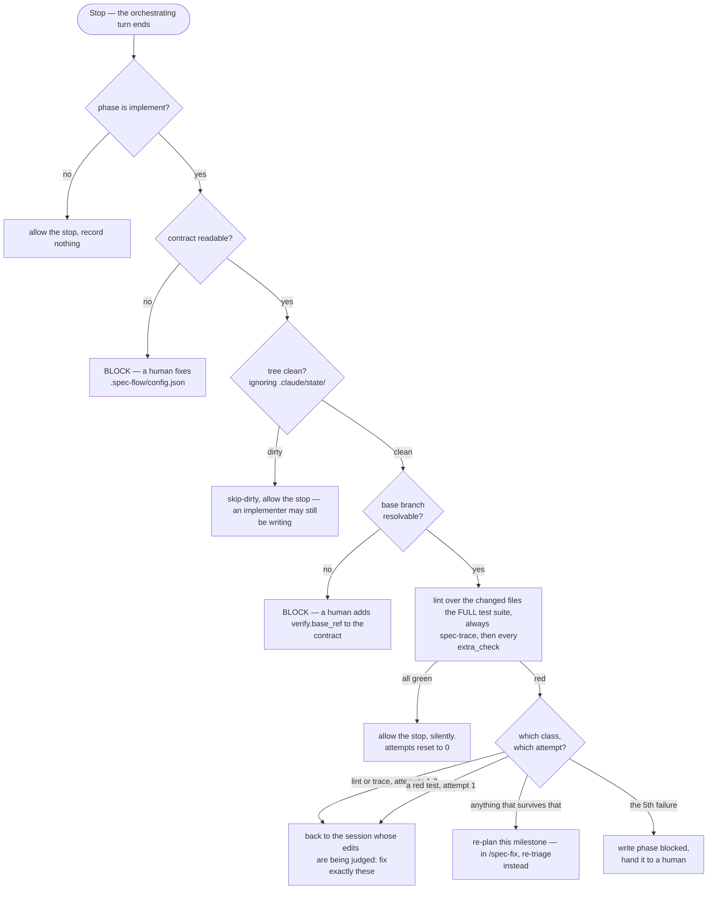

# spec-flow — the engine

A spec-driven multi-agent pipeline for Claude Code: a free-text requirement
becomes a spec (with a human sign-off), a milestone-by-milestone plan, a
review pass, and an implementation loop gated by lint, tests and requirement
traceability running **outside the model**. Two orchestrators —
`/spec-flow` for a feature, `/spec-fix` for a defect — drive five subagents,
each pinned to the model its job actually needs (Haiku for a checklist pass,
Sonnet for writing code, Opus for planning and hard calls, budgeted).

This repository is the **engine**: the hooks, the agents, the commands, and
the checks that make the whole thing hold together. It has no opinion about
what language, framework or architecture the repo it runs in uses. That
opinion — and everything the engine needs to know to run correctly — lives in
one file the *consuming* repo writes: `.spec-flow/config.json`.

## Install

```bash
claude marketplace add IgnacioMarin402/spec-flow-plugin
claude plugin install spec-flow@spec-flow-marketplace
```

## The one file a consuming repo must write

Nothing below is optional if you want to run `/spec-flow` or `/spec-fix`:

```json
{
  "contract_version": 1,
  "verify": {
    "scope_globs": ["*.ts"],
    "lint": ["node", "node_modules/.bin/eslint", "--fix"],
    "lint_no_fix": ["node", "node_modules/.bin/eslint"],
    "test": ["node", "node_modules/.bin/vitest", "run"],
    "test_name": "vitest",
    "lint_name": "eslint",
    "lint_config_hint": "eslint.config.mjs"
  },
  "trace": {
    "specs_dir": "specs",
    "proof_dir": "src",
    "proof_suffix": ".test.ts"
  },
  "extra_checks": [],
  "unscoped_denied": {
    "scripts": ["test", "lint"],
    "tools": ["eslint", "vitest"],
    "scoped_allowed": ["check"],
    "scoped_alternative": "npm run check"
  }
}
```

Put this at `.spec-flow/config.json` in the repo root. `verify` says how to
lint and test; `trace` says where specs live and what a proof file looks like
— `spec-trace` uses this to bind a requirement id to the test that proves it,
in both directions, and **a test that does not run is not proof**: a title
tagged with a requirement id under `it.skip`, `it.todo`, `xit` or `xtest`
counts as unproven, exactly as if it were absent. Skipping a test is the
cheapest way to silence a red suite, and accepting it as proof would leave
the requirement reading as covered while nothing executes; `extra_checks` is
how your own project-specific checks
(an architecture rule, a boundary check) plug into the same gate;
`unscoped_denied` is what the engine redirects when an agent tries to run the
whole suite mid-milestone instead of the scoped form.

**`trace.proof_dir` and `trace.proof_suffix` do two jobs, not one.** They are
what `spec-trace` searches, and they are also where the planner and the
implementer are told to *put* a new test: a proof file is one whose path
contains a segment named `proof_dir` and whose name ends in `proof_suffix`, and
an agent that writes its test anywhere else produces a requirement that reads
as unproven and a gate that blocks on a test which exists and passes. So these
two values are a placement policy as much as a search pattern — set `proof_dir`
to the directory your tests actually live in (`test`, `tests`, `spec`, or your
source root if you genuinely colocate), and the agents will follow it. Nothing
in the engine overrides it, and nothing guesses it.

**The base branch is resolved automatically, and a base that cannot be
resolved stops the run.** "The files this branch changed" needs something to
compare against, and the engine looks for it in this order: `verify.base_ref`
if you declared it, then `refs/remotes/origin/HEAD` (what `git clone` records
as the remote's default branch), then `origin/main`, `main`, `origin/master`,
`master`, `origin/develop`, `develop`, `origin/trunk`, `trunk`. If none of
those resolves, the gate **blocks** and names the field to add. It does not
fall back to a default, because the only available fallback — comparing HEAD
against itself — produces an empty changed-file list, which is
indistinguishable from "this milestone touched nothing" and used to be
reported as a clean pass over an unrun linter.

Add `"base_ref": "origin/trunk"` under `verify` when your base is something
the ladder cannot find (a release branch, a fork's upstream, a shallow or
single-branch CI checkout that fetched no other ref). Declaring it always
wins over the automatic ladder.

**The engine assumes a feature-branch workflow.** Scope is computed against
the merge-base with your base branch, so work committed *directly onto* the
base branch has a scope of zero files by construction — `verify.lint` will
have nothing to run on. The suite still runs (see below) and the unscoped
checks still run, so the gate is not disarmed by this, but lint coverage is
only as good as the branch you are on.

**`verify.test` is invoked with no extra arguments — the full suite, every
time the gate is armed.** Not scoped to the changed files, and not skipped
when nothing in scope changed either: both follow from the same fact, that a
suite's outcome is a property of the system rather than of any file. Only
`verify.lint` is scoped, because `lint(file)` really is a predicate about one
file. Do not add a flag like `--passWithNoTests` to `verify.test` to work
around a runner that exits non-zero on an empty match: that class of problem
no longer exists once the gate stops appending file paths to the test
command, and a flag that makes an empty run exit 0 makes an EVERY run that
happens to match nothing exit 0 too — a green gate over zero executed tests,
which is worse than the slow-and-loud failure it would be "fixing". This is
not a contradiction of `unscoped_denied` above: that setting stops the AGENT
from running the whole suite mid-milestone to keep irrelevant output out of
its context; the gate itself runs out-of-model and truncates before anything
reaches a model, so the two rules protect different things and both stand.

**Also required: `.claude/state/` must be in the consuming repo's
`.gitignore`.** The gate writes its own history and failure logs there on
every run. If that directory is tracked, the tree is never clean again after
the first pass, and the gate's quiescence guard (`skip-dirty`) silently skips
every run after that — forever, with nothing in the output to say why. The
gate itself now filters `.claude/state/` out of its dirty check as a second
line of defense, but gitignoring it is still what keeps a human's `git
status` legible.

**`verify.test` must finish inside the Stop hook's time budget.** The gate
runs as a `command` hook on `Stop`, and Claude Code cancels a hook that
reaches its timeout: the output is discarded and the hook renders no
decision — which, for a Stop hook, means the stop is allowed. A suite that
runs long therefore does not produce a slow gate, it produces a *silently
absent* one: no block, and no line in `gate-history.log` either, because the
process was killed before it could write one. This is the one gate failure
mode `gate.mjs`'s own catch-all cannot reach, since it happens a layer above
the process.

The plugin declares `"timeout": 1800` on the Stop hook, well above the 600s
default, which is enough headroom for most repos. It is headroom, not a
removed ceiling. If your full suite can approach thirty minutes, declare a
smoke subset as `verify.test` and leave the exhaustive run to CI — a gate you
can rely on beats a gate that checks everything and occasionally checks
nothing without saying so. `gate-history.log` is how you audit this: a stop
that produced no line at all, in a run where the phase was `implement` and
the tree was clean, is the signature.

**There is no fallback that guesses these for you.** A repo this engine has
never seen has no safe default test runner or proof directory — see
`scripts/spec-flow-config.mjs`'s own header for why a missing or incomplete
contract fails loudly, with a message naming exactly what to add, rather than
silently running with someone else's values.

Also required: `specs/` (capability specs, one per module, each starting
`<!-- spec-scope: <path> -->`) and `specflow/` (where live change specs and
`specflow/archive/` for finished ones live) as directories in the repo root.
The engine creates entries under them; it does not create the directories.

## Two ways to reach the same checks

The hooks (`hooks/*.mjs`) are how Claude Code itself enforces the gate,
armed automatically once a run reaches the `implement` phase. But
`${CLAUDE_PLUGIN_ROOT}` — how a hook finds its own installation — only
exists inside a Claude Code session. A human's terminal and CI need the same
checks and do not have it, so this also ships as an installable CLI:

```bash
npm install --save-dev github:IgnacioMarin402/spec-flow-plugin
```

```json
{
  "scripts": {
    "check": "spec-flow check",
    "spec:check": "spec-flow trace",
    "flow:stats": "spec-flow stats"
  }
}
```

The hook and these aliases resolve to and run the **same file** — that is
what keeps "same files, same commands, same result" structural rather than a
promise kept by two copies that happen to agree today. See
`bin/spec-flow.mjs`.

## Commands and agents

- `/spec-flow <requirement>` — the full pipeline: spec, plan, review,
  milestone-by-milestone implementation, fold.
- `/spec-fix <what's broken>` — the lighter defect flow: triage against
  `specs/`, one implementer pass, same gate. No planner, no reviewer.
- `agents/` — `spec-writer` (Sonnet), `planner` (Opus), `reviewer` (Haiku),
  `implementer` (Sonnet), `architect` (Opus).

### Skills: the one capability this engine gives up on purpose

The agents here declare **no** `skills:` frontmatter, and cannot. Preloading
happens before an agent reads anything, so it has to name specific skills —
and a skill encodes how one codebase is built, which is exactly what this
engine has no business knowing. The repo this was extracted from preloaded
two (`where-does-it-live`, a layer router; `write-path`, guarding a mistake
that is expensive to unwind); shipping those names here would fail
`no-repo-refs.mjs` on sight, correctly.

So `implementer.md` and `planner.md` carry the `Skill` *tool* and are told to
read `.spec-flow/skills.md` — a decision→skill table the consuming repo
writes — and load whatever it routes them to, on demand.

**This is a real capability loss, not a neutral refactor.** On-demand loading
fires only once the agent already suspects it needs the skill, which is
precisely the case a preload was protecting. A consuming repo that wants it
back adds its own `agents/implementer.md` with a `skills:` line naming its own
skills. Whether a project-level agent cleanly overrides a plugin-shipped one
of the same name is **not something this repo has verified** — check it before
relying on it.

## The flow, end to end

Both commands drive the same state machine, and its spine is one file:
`.claude/state/phase`. The orchestrator writes the current phase before each
step, and every enforcement hook decides whether it is armed by reading it.
Nothing else coordinates a run — no queue, no daemon, no shared memory between
agents. A subagent finishes, the orchestrator's turn ends, and a `Stop` hook
runs the checks outside the model and either allows the stop or blocks with
the instruction for what to do next.

Three properties are worth holding before reading the diagrams:

- **The orchestrator never writes code.** It routes. Everything that produces
  an artifact is a subagent pinned to the model its job needs.
- **The gate is not a step in the pipeline — it is what happens when the
  pipeline stops.** It fires on `Stop`, judges whatever is on disk at that
  instant, and its block message *is* the orchestrator's next instruction.
- **A pass is silent.** The gate allows the stop and prints nothing, so
  nothing wakes the orchestrator back up. Both commands work around that by
  scheduling a self check-in a couple of minutes out when the session provides
  a scheduling tool; where it does not, a green milestone simply waits for the
  human's next message. A run that looks stalled after a milestone is usually
  a run that passed.

### `/spec-flow` — a feature


Both human gates sit in the spec phase, and that is the point: it is the last
moment at which "no" costs nothing, and the gate is disarmed there, so waiting
for a person is free. A rejection is stamped and archived rather than deleted
— the archived "no" is what somebody re-proposing the same idea in three
months needs to find.

Two things the diagram cannot show. Each milestone gets a **fresh** implementer
session, but every follow-up within that milestone — architect guidance, a
lint fix, a re-implementation after a re-plan — goes back to the *same*
session. A new session re-reads the plan, `CLAUDE.md` and every touched file
from a cold context and a cold prompt cache, and that repeated re-reading
across gate retries is where most of a run's token cost goes. And the
implementer works **test-first per requirement**: the failing REQ-named test,
run alone to see it fail, then the code. The gate only ever sees the final
state, so that ordering lives in the contract and nowhere else.

### `/spec-fix` — a defect

A feature is an open question about what the system should do. A defect is a
closed question: the system already claims a behaviour and something disagrees
with the claim, so the whole job is finding out **which side is wrong**. That
is a triage, not a planning exercise — which is why this flow drops the
planner and the reviewer entirely and costs one implementer pass.


Only cases 3 and 5 stop for a human. Rewriting a requirement so it agrees with
the code is indistinguishable, from the diff alone, from rewriting it so it
agrees with the *bug* — and the second one quietly turns the source of truth
into a description of whatever the system happens to do. Cases 1, 2 and 4
touch nobody's claim about the system, so they run through.

The work order is the one place an orchestrator does work instead of routing
it, and it writes the same two paths `/spec-flow` produces (`plan.md`,
`milestones/M1.md`) because the implementer contract is reused verbatim. Note
where a surviving failure goes: back to the **triage**, not to a planner. A
fix whose test will not go green is usually a fix aimed at the wrong case.

### The gate — what happens when a turn ends



Four things this diagram is really saying:

- **A dirty tree is not judged.** Implementer subagents run in the background,
  so a `Stop` can fire mid-write; judging that snapshot manufactures failures.
  Dirty trees belong to the environment's git check, clean ones to the gate.
- **Lint is scoped to the branch's changed files, tests never are.**
  `lint(file)` is a total predicate over one file, so scoping it is exact. A
  suite's outcome is a property of the system, not of a file — a scoped run
  can stay green while the change breaks a consumer outside the diff, which is
  the exact silent-pass this engine exists to close. The same reasoning is why
  an empty scope does not skip the suite: "no file in scope changed" is a
  statement about the diff, and an empty diff is not always real.
- **An unresolvable base branch is a refusal, not an empty scope.** Everything
  scoped depends on knowing what this branch is compared against. When that
  answer is a guess, an empty changed-file list stops meaning "nothing
  changed" and starts meaning "I could not tell" — and those two must never
  produce the same outcome, because one of them is a pass.
- **The failure class decides the route, not the severity.** A traceability
  gap groups with lint because its usual cause is a test that proves the
  requirement and never named it — an edit, not a re-think. A red test always
  routes as behaviour, and so does any `extra_check` that declared itself
  `class: "behaviour"`.
- **It fails closed, alone among the hooks.** Every other hook here allows the
  tool call if it crashes, which is no worse than not existing. A `Stop` hook
  that exits 0 without printing *allows the stop* — so an unhandled throw
  would not skip the gate, it would report a clean milestone. Code written
  with the gate off looks exactly like code that passed it, so an internal
  error blocks and says so.

### Phases, and what each one arms

| phase | written by | what it arms |
|---|---|---|
| `spec` | the orchestrator, at intake | Opus budget, `done-guard`, `arm-gate` |
| `plan` | the orchestrator | Opus budget, `done-guard`, `arm-gate` |
| `review` | the orchestrator | Opus budget, `done-guard`, `arm-gate` |
| `implement` | the orchestrator — or `arm-gate`, if it forgot | **the gate**, **lint-on-write**, **the whole-repo command deny**, Opus budget, `done-guard` |
| `blocked` | the **gate itself**, at the attempt cap | Opus budget, `done-guard`, `arm-gate` |
| `done` | the orchestrator, if `done-guard` lets it through | nothing |
| `idle` | the orchestrator on a rejection; `session-start` on an abandoned run | nothing |

**This vocabulary is a closed set — never extend it.** Every hook falls
through to "not my business" on a value it does not recognise, so inventing a
phase like `triage` or `fix` runs the flow with the gate, the write-time
linter, the command deny and the Opus budget **all disarmed at once**, and
nothing anywhere says so.

Two transitions are backstopped rather than trusted, and both for the same
reason — the failure they prevent is invisible. `arm-gate` writes `implement`
itself if an implementer is engaged without it. `done-guard` denies writing
`done` while any unscoped check is red or `specflow/` still holds an
unarchived change folder: `done` disarms everything, so it has to be earned
rather than declared.

### The hooks

| hook | event | fires on | what it does |
|---|---|---|---|
| `session-start` | `SessionStart` | — | resets a phase left at `implement`/`blocked` for 6h+ to `idle`, so an abandoned run cannot gate an unrelated session |
| `no-gate-cmds` | `PreToolUse` | `Bash` | denies whole-repo lint/test runs while implementing; the scoped forms the contract declares stay allowed |
| `done-guard` | `PreToolUse` | `Bash`, `Write`, `Edit` | denies an unearned `done` |
| `opus-budget` | `PreToolUse` | `Task`, `Agent`, `SendMessage` | counts every planner/architect call — spawns *and* follow-up messages — and denies past the cap |
| `arm-gate` | `PreToolUse` | `Task`, `Agent`, `SendMessage` | writes `implement` when the implementer is engaged without it |
| `lint-on-write` | `PostToolUse` | `Write`, `Edit` | lints the single file just written and blocks with the violations, while the file is still in context |
| `register-agent` | `PostToolUse` | `Task`, `Agent` | maps opaque session ids back to the agent type, so `opus-budget` can charge a `SendMessage` |
| `run-trace` | `PostToolUse` | `Write`, `Edit`, `Read`, `Bash`, `Task`, `Agent` | the run's observable timeline. Enforces nothing, always exits 0 |
| `gate` | `Stop` | — | the external gate above |

Only `gate`, `lint-on-write` and `no-gate-cmds` are armed exclusively by the
`implement` phase. `opus-budget`, `arm-gate` and `done-guard` stand down only
outside a run (`idle`/`done`), and `register-agent`, `run-trace` and
`session-start` never enforce anything at all.

### The second config file

`.spec-flow/config.json` is the contract, and it is the one every hook reads.
There is exactly one setting that lives elsewhere:

```json
{ "max_opus_calls": 6 }
```

at `.claude/spec-flow.config.json`. It caps how many planner + architect calls
one run may make, defaults to 6 if the file is absent, and is deliberately not
part of the contract: it is a run-scoped budget, not an architectural fact
about the repo. When it runs out, the spawn is denied and the orchestrator is
told to stop and summarize for a human — which is exactly what the budget is
for, so do not work around it. The counter lives in `.claude/state/opus_calls`.

## Development

```bash
npm install
npm run lint         # eslint over hooks/ and scripts/
npm run typecheck    # tsc --noEmit --checkJs — this repo's own type check
npm run check        # no-repo-refs.mjs — no coupling to the origin repo
npm run gate:check   # gate-fixture.mjs — the gate holds under its own failure modes
npm run trace:check  # spec-trace-fixture.mjs — the requirement/proof binding holds
npm run hooks:check  # hook-smoke.mjs — the other eight hooks
```

All six run in CI on every push and PR.

## Design history

This engine used to be fused into one repo
(`api-nestjs-with-spec-driven-development`), and the extraction — what moved,
what stayed, what the language decision cost and why, three defects the
fixture in `scripts/gate-fixture.mjs` was built to catch — is documented in
that repo's `docs/spec-flow-as-a-plugin.md`. This repo does not duplicate it.
