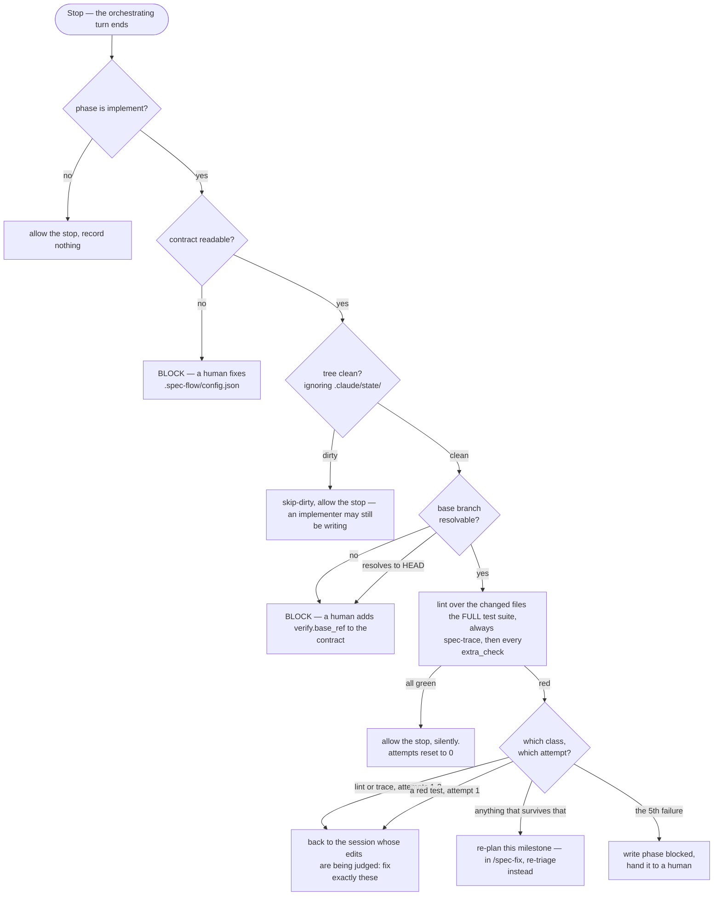

# spec-flow

A spec-driven multi-agent pipeline for Claude Code. A free-text requirement
becomes a spec you sign off on, a milestone-by-milestone plan, a review pass,
and an implementation loop gated by lint, tests and requirement traceability
running **outside the model**.

Two commands — `/spec-flow` for a feature, `/spec-fix` for a defect — drive
five subagents, each pinned to the model its job needs. The engine has no
opinion about your language, framework or architecture: that lives in one file
your repo writes, `.spec-flow/config.json`.

Every field, table and flag is in **[REFERENCE.md](REFERENCE.md)**.

---

## Requirements

- Claude Code, and a git repo with a base branch you branch off of
- Node 20+
- A linter and a test runner you can invoke from the command line

## Install

**1. Install the plugin.**

```bash
claude marketplace add IgnacioMarin402/spec-flow-plugin
claude plugin install spec-flow@spec-flow-marketplace
```

An install does not stay current on its own. Run `/plugin marketplace update`
(or `claude plugin update spec-flow`) to pull whatever has landed on `main`
since — see [REFERENCE](REFERENCE.md#staying-current) for why that command
does nothing on some plugins and does not here.

**2. Install the CLI too.** The hooks reach the engine through
`${CLAUDE_PLUGIN_ROOT}`, which only exists inside a Claude Code session. Your
terminal and CI need the same checks:

```bash
npm install --save-dev github:IgnacioMarin402/spec-flow-plugin
```

```json
{
  "scripts": {
    "check": "spec-flow check",
    "spec:check": "spec-flow trace",
    "flow:stats": "spec-flow stats"
  }
}
```

The hook and these aliases run the **same file**, so "same files, same
commands, same result" is structural rather than two copies that agree today.

**3. Generate the contract.**

```bash
npx spec-flow init
```

It writes `.spec-flow/config.json` by reading what your repo already declares
— your `test` and `lint` scripts, where your tests live, which extensions you
use, your base branch — then creates `specs/` and `specflow/archive/` and adds
`.claude/state/` to `.gitignore`.

It never invents a value it could not determine. Every field lands in one of
three buckets, and it tells you which:

```
detected  verify.test — from the "test" script: node node_modules/.bin/vitest run
REVIEW    trace.proof_dir is "lib" — a guess. Your tests are not in a
          directory of their own, so no segment identifies one.
MISSING   verify.lint_config_hint — no config file for the linter was found.
```

`detected` is read from your repo. `REVIEW` is an inference worth confirming.
`MISSING` is left empty on purpose, so the contract does not validate until
you fill it — a plausible wrong value would run, and a missing one is
reported. Init exits non-zero while anything is missing.

Fill in what it asks for, then re-run with `--force` or edit the file
directly. Every field is documented in
[REFERENCE.md](REFERENCE.md#the-contract).

**4. Check it.**

```bash
npx spec-flow check
```

Lints the files this branch changed, runs your suite, and runs the
traceability check — the same commands the gate will run, through the same
file. If this is green, the gate will be too.

---

## Your first run

```
/spec-flow users can reset their password by email
```

What happens:

0. **The run refuses to start** if the contract does not load or the base
   branch does not resolve. That check costs nothing — no agent has run yet —
   and it is why step 3 of the install matters.
1. **The spec-writer asks you questions** if the requirement is ambiguous.
   Answer in the chat.
2. **You sign off.** It shows the requirement deltas and the decision, and
   waits. This is the last moment "no" costs nothing. A rejection is stamped
   and archived, not deleted.
3. **Plan, review, then implementation** — one milestone at a time, each in a
   fresh implementer session, test-first per requirement.
4. **The gate runs when the turn ends.** Green allows the stop; red blocks and
   tells the orchestrator what to fix.
5. **Fold and done.** The change spec is verified against `specs/`, stamped
   SHIPPED, archived with the run's telemetry.

**A pass is silent.** The gate allows the stop and prints nothing, so nothing
wakes the orchestrator back up. Both commands schedule a self check-in when
the session provides a scheduling tool; where it does not, a green milestone
waits for your next message. **A run that looks stalled after a milestone is
usually a run that passed** — say "continue".

If it stops and asks for a human, read `.claude/state/gate-failure.log`.

---

## How it works

Nothing coordinates a run but `.claude/state/phase` — no queue, no daemon, no
shared memory between agents. A subagent finishes, the orchestrator's turn
ends, and a `Stop` hook runs the checks outside the model and either allows
the stop or blocks with the instruction for what to do next.

- **The orchestrator never writes code.** It routes. Everything that produces
  an artifact is a subagent pinned to the model its job needs.
- **The gate is not a step in the pipeline** — it is what happens when the
  pipeline stops. Its block message *is* the next instruction.

### `/spec-flow` — a feature


Each milestone gets a **fresh** implementer session, but every follow-up
within that milestone goes back to the *same* session — a new session re-reads
the plan and every touched file from a cold context, and that repeated
re-reading across retries is where most of a run's token cost goes.

### `/spec-fix` — a defect

A feature is an open question about what the system should do. A defect is a
closed question: the system already claims a behaviour and something disagrees
with the claim, so the job is finding **which side is wrong**. That is triage,
not planning — which is why this flow drops the planner and the reviewer.


Only cases 3 and 5 stop for a human. Rewriting a requirement so it agrees with
the code is indistinguishable, from the diff alone, from rewriting it so it
agrees with the *bug*. A surviving failure goes back to **triage**, not to a
planner: a fix whose test will not go green is usually aimed at the wrong case.

### The gate



- **A dirty tree is not judged.** Implementers run in the background, so a
  `Stop` can fire mid-write; judging that snapshot manufactures failures.
- **Lint is scoped to the changed files, tests never are** — and an empty
  scope does not skip the suite either. `lint(file)` is a predicate about one
  file; a suite's outcome is a property of the system.
- **An unresolvable base is a refusal, not an empty scope.** "Nothing changed"
  and "I could not tell" must never produce the same outcome, because one of
  them is a pass. A base that resolves *to HEAD* is refused for the same
  reason: work committed straight onto the base branch has an empty diff by
  construction, so the scoped linter never runs for the whole run.
- **The failure class decides the route, not the severity.** A traceability
  gap is usually a test that proves the requirement and never named it — an
  edit, not a re-think.
- **It fails closed, alone among the hooks.** A `Stop` hook that exits without
  printing *allows the stop*, so an unhandled throw would report a clean
  milestone rather than skip the gate.

**A test that does not run is not proof.** A title tagged with a requirement
id under `it.skip`, `it.todo`, `xit` or `xtest` counts as unproven, exactly as
if it were absent — skipping is the cheapest way to silence a red suite.

---

## Developing the engine

```bash
npm install
npm run lint          # eslint over hooks/ and scripts/
npm run typecheck     # tsc --noEmit
npm run check         # no coupling to any one consuming repo
npm run paths:check   # every ${CLAUDE_PLUGIN_ROOT} path resolves
npm run init:check    # what `init` generates actually validates
npm run gate:check    # the gate holds under its own failure modes
npm run trace:check   # the requirement/proof binding holds
npm run hooks:check   # the other nine hooks
```

All eight run in CI on every push and PR.

---

## License

MIT — see [LICENSE](LICENSE).
