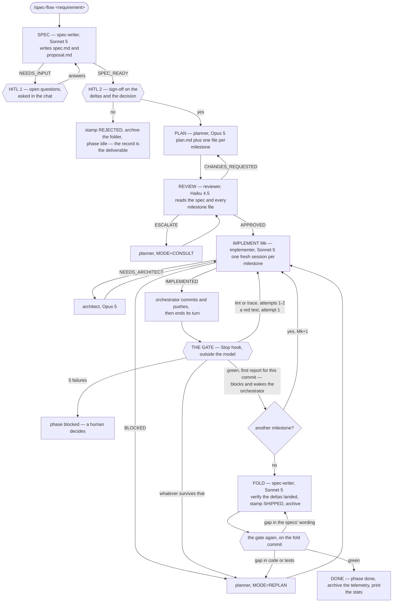
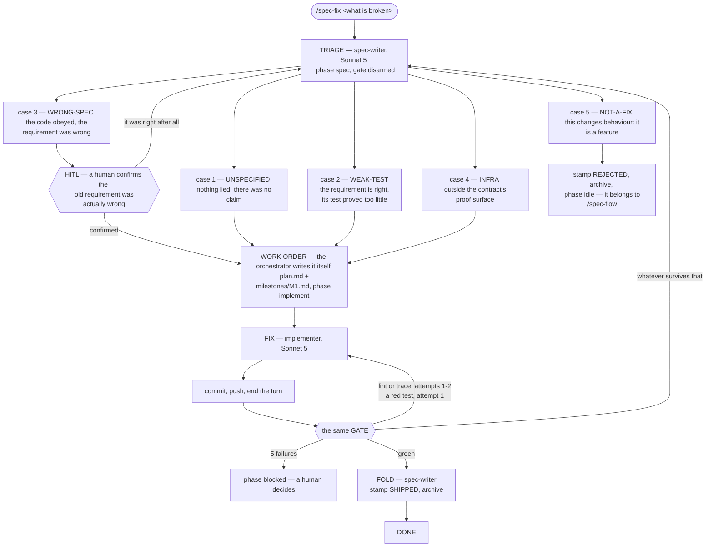
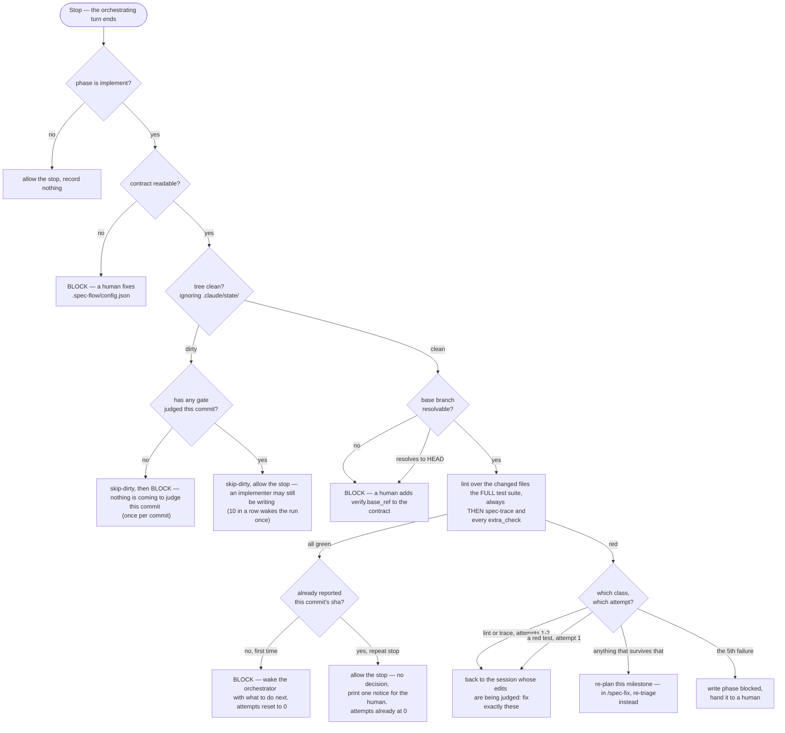

# Reference

Look-up material. For what spec-flow is and how to install it, see the
[README](README.md).

- [The contract](#the-contract) — every field of `.spec-flow/config.json`
- [Four rules the contract cannot express](#four-rules-the-contract-cannot-express)
- [The base branch](#the-base-branch)
- [The second config file](#the-second-config-file)
- [Staying current](#staying-current)
- [Project skills](#project-skills)
- [Commands and agents](#commands-and-agents)
- [CLI](#cli)
- [Hooks](#hooks)
- [Phases](#phases)
- [`.claude/state/`](#claudestate)
- [What an install costs](#what-an-install-costs)
- [How a run unfolds](#how-a-run-unfolds) — the three flowcharts

---

## The contract

Everything the engine needs to know about your repo, at
`.spec-flow/config.json`. Missing or malformed stops the run with a message
naming what to add — there is no fallback that guesses a test runner or a
proof directory for a repo it has never seen.

`spec-flow init` generates this file from your repo and reports what it could
not determine. Use the tables below to fill those in, or to change what it
wrote. To re-read the contract as the engine sees it at any time:

```bash
node node_modules/spec-flow-plugin/scripts/spec-flow-config.mjs
```

### `verify`

| key | required | what it is |
|---|---|---|
| `scope_globs` | yes | Which files count as in-scope, e.g. `["*.ts"]` |
| `lint` | yes | argv that lints, autofix on. Receives changed file paths appended |
| `lint_no_fix` | yes | Same, report only. Used by `spec-flow check --no-fix` |
| `test` | yes | argv that runs the suite. Invoked with **no** extra arguments |
| `test_name` | yes | Names the runner in log sections, e.g. `"vitest"` |
| `lint_name` | yes | Names the linter in log sections |
| `lint_config_hint` | yes | Where your lint rules live, quoted back when a rule fires |
| `base_ref` | no | The ref this branch is judged against. Omit to auto-resolve |

### `trace`

| key | required | what it is |
|---|---|---|
| `specs_dir` | no | Where capability specs live. Default `specs` |
| `report` | no | `{format, path}` of the test report the engine reads. `format` is `junit` or `tap` |
| `executed_tests` | no | Argv whose output names the tests that RAN, one per line. The alternative to `report` |
| `proof_dir` | yes | Directory a new test goes in, e.g. `test` |
| `proof_suffix` | yes | What a test file is called here, e.g. `.test.ts` |
| `not_a_capability` | no | Filenames under `specs_dir` that are not specs. Default `["README.md", "glossary.md"]` |
| `require_skills_field` | no | Fail a live milestone with no `Skills:` field. Default `false` |

#### What makes a requirement proven

A requirement is proven when a test **that actually ran** names its id. Declare
one source for that, and only one — the contract refuses both.

**`report` — the default.** Your test command already writes a report; the
engine reads it.

```json
"report": { "format": "junit", "path": "reports/junit.xml" }
```

You add the reporter flag to `verify.test` — `--reporter=junit`,
`--junitxml=`, whatever yours spells it — and nothing else. The engine parses
the file itself and no code is yours to write.

This works without the engine knowing your runner because **the format answers
the question, not the tool**: `<skipped/>` is an element in the JUnit schema and
`# SKIP` is a directive in the TAP spec, so a test that did not run is
identifiable in a file whoever wrote it. Which *flag* produces that file is
per-runner knowledge and stays out of the engine — see
[ADR-005](decisions/005-a-report-format-is-not-a-runner.md), and ADR-002 before
it for the half that still holds. `init` proposes the path, marked `REVIEW`,
because a path it inferred is not a path it read.

**`executed_tests` — the escape hatch.** For a runner with no standard report:
argv whose stdout names the tests that ran, one per line.

```json
"executed_tests": ["node", ".spec-flow/tests-that-ran.mjs"]
```

`spec-flow init --translator` scaffolds that file with the contract and one
marked hole, and it exits non-zero until you fill it — an unfinished translator
reporting nothing would turn every requirement unproven, which is the failure
this check exists to catch arriving through the file meant to prevent it. `init`
never overwrites it once written, `--force` included.

Two properties either source must have, and the second is the one worth
checking:

- **Names carry the id**, since it is matched inside them. An id may sit
  against underscores — `describe > REQ-USER-001_rejects` and
  `test_REQ_USER_001_rejects` both bind, the second because `_` is also read as
  `-` — but a fourth digit does not, so `REQ-USER-0011` is never read as
  `REQ-USER-001`.
- **A skipped test must not appear.** That absence is what makes skipping
  useless as a way to silence this check, and it holds however the skip was
  written: `it.skip`, `test.todo`, `describe.skip`, a runner's `--grep` leaving
  the test unselected, and a runtime `t.skip()` all end in the same place —
  reported by nothing.

**Traceability is off while there is nothing to prove**, and the gate still
lints and runs your suite. Two things put you there, and a fresh install is
normally the second: declaring neither source, or declaring one that has not
produced anything yet — the report your test command does not write until you
add the reporter flag. `spec-trace` says which, and passes. It stops being
allowed the moment a requirement exists: from then on an unreadable source is
refused rather than passed, because an opt-out that outlives its own
precondition is a disarmed check, and a requirement it *could* not prove is
never reported as one it *did* not prove.

`spec-trace` reads its source after the suite, and separates the ways proof can
be absent instead of collapsing them — a report that was never written, a report
holding nothing, a report whose every case was skipped, and a requirement with
no test are four different messages. Run `spec-flow check` rather than
`spec-flow trace` alone: the first runs your suite before the checks, the second
reads whatever the last run left.

`proof_dir` and `proof_suffix` no longer decide what counts as proof. They kept
their other job — telling the planner and implementer where a new test goes and
what it is called — so set them to where your tests actually live. A test the
runner reports proves its requirement wherever it sits; getting these wrong now
costs consistency, not a blocked gate.

**An empty `specs_dir` passes, but only until your first ship.** With no
capability specs there are no requirements, so "every requirement is proven"
is true of the empty set. That is correct while adopting — capability specs
are written *by* the flow, as milestones fold their deltas in, so requiring
them before the first run completes would block adoption on an artifact the
run produces.

The grace ends at the first change stamped `**Status:** SHIPPED`. That stamp
is the fold asserting its deltas landed in `specs_dir`, so SHIPPED with an
empty spec layer is two records contradicting each other and `spec-trace`
fails. If you hit that and your specs do exist, check `trace.specs_dir` —
they are somewhere this contract does not look. `REJECTED` and `SUPERSEDED`
assert nothing landed, so they keep the grace.

### Writing a capability spec

`spec-trace` enforces three rules a spec must follow, and `spec-flow init`
writes them into `specs/README.md` so the file the agents defer to actually
exists. In short:

```markdown
<!-- spec-scope: modules/user -->

# User

### REQ-USER-001 — the user can reset their password by email

The system sends a single-use link, valid for one hour.
```

- **The id prefix comes from the filename.** `specs/user.md` declares
  `REQ-USER-` ids, `specs/user-profile.md` declares `REQ-USER-PROFILE-`. A
  mismatch fails.
- **Exactly three digits**: `REQ-USER-001`, not `REQ-USER-1`.
- **The scope marker is required**, naming the code the spec is about.

Requirements are `###` headings with the id first; the separator after it may
be an em dash, a hyphen or a colon. Ids are permanent — never renumbered,
never reused. Every requirement needs a test that **runs** and whose reported
**name** contains its id — where that test's file lives is a convention your
repo sets, not something this check decides.

### Declaring a delta

A change spec under `specflow/<SLUG>/` says what it does to `specs/` in three
shapes, and only two of them are provable. `ADDED` fails the gate when the new
id has no test that ran; `REMOVED` fails it when a test still reports an id no
spec declares. `CHANGED` is checked by nothing on its own — the id already
exists and already has a test, so the binding holds before the edit and after
it, whatever the body now says.

The suite covers most of that gap: change the behaviour, change the code, and
a test asserting the old behaviour goes red. What it does not cover is a
`CHANGED` that **widens**. Add a clause to an existing requirement and nothing
breaks, because nothing that used to pass stopped passing — the clause is now
claimed by `specs/` and proven by nobody.

So a behaviour claim that appears, disappears or changes is written as
`REMOVED` on the old id plus `ADDED` on a new one, and `CHANGED` is reserved
for the two edits that move no proof. It must name which:

```markdown
- CHANGED REQ-USER-001 (wording)    — means what it meant; the text is clearer
- CHANGED REQ-USER-001 (correction) — was wrong; now matches behaviour that
                                      already exists and is already proven
```

`(correction)` is legal only in a `/spec-fix` brief — case 3, the one that
flow stops for a human on. `spec-trace` fails a `CHANGED` with no kind, an
unrecognised kind, or `(correction)` anywhere else. Live change specs only;
archived ones predate the rule. See ADR-009.

### `extra_checks`

Your own project checks, run at every gate and again at `done`. Each entry:

| key | required | what it is |
|---|---|---|
| `name` | yes | Shown in gate output |
| `cmd` | yes | argv, e.g. `["node", "scripts/my-check.mjs"]` |
| `field` | yes | The key it writes in `gate-history.log` |
| `green` | no | Line printed when it passes |
| `hint` | no | Appended to the block message when it fails |
| `class` | no | `"lint/trace"` (route as an edit, default) or `"behaviour"` (route as a re-plan) |

A check whose `cmd` names a repo-local script you have not written yet is
skipped, not failed — a repo mid-adoption is not blocked by its own pending
check. A check that names a binary or inline code is always run.

### `unscoped_denied`

What the engine redirects when an agent tries to run the whole suite
mid-milestone instead of the scoped form.

| key | what it is |
|---|---|
| `scripts` | Package scripts denied while implementing, e.g. `["test", "lint"]` |
| `tools` | Binaries denied directly, e.g. `["vitest", "eslint"]` |
| `scoped_allowed` | Scripts that stay allowed, e.g. `["check"]` |
| `scoped_alternative` | What to run instead, quoted in the denial |
| `scoped_examples` | Concrete allowed invocations, shown in the denial |

This is a consistency guard, not a security boundary — it is evadable and says
so in its own source. It exists to keep whole-suite output out of an agent's
context, not to stop a determined agent.

---

## Four rules the contract cannot express

**`.claude/state/` must be gitignored.** The gate writes there on every run.
Tracked, the tree is never clean again and the gate's quiescence guard skips
every run after the first — forever, silently. The gate filters that path out
of its own dirty check as a second line of defense; gitignoring it is what
keeps `git status` legible.

**Do not add `--passWithNoTests`** (or any equivalent) to `verify.test`. A
flag that makes an empty run exit 0 makes *every* run that matches nothing
exit 0 — a green gate over zero executed tests.

**`verify.test` must finish inside 1800s.** The gate is a `command` hook on
`Stop`; a hook that hits its timeout is canceled, renders no decision, and a
Stop hook with no decision **allows the stop**. That happens a layer above the
gate's own process, so nothing inside it can block or report at the time. If
your suite can approach thirty minutes, declare a smoke subset here and leave
the exhaustive run to CI.

It is at least no longer silent. The gate writes a `result=running` line to
`gate-history.log` before it spawns anything, and every outcome replaces that
line — so a `running` line that survives is proof the invocation which wrote
it was killed. The next armed gate finds it, records `fail:killed`, and blocks
once with what to do about it. The stop it happened on was still allowed and
that milestone was still unverified; what changed is that you find out.

**The engine assumes a feature-branch workflow, and now checks the
assumption.** Scope is the merge-base diff with your base branch, so work
committed directly onto the base branch resolves a base equal to HEAD: the
diff is empty by construction, and `verify.lint` — the one scoped check — has
nothing to run on, for that milestone and every one after it. The suite,
spec-trace and the extra checks are unscoped and do run, so this was never a
disarmed gate; it was one check quietly sitting out a whole run while
`lint=-` in the history said so in a way nothing read.

The gate now **blocks** on it instead, naming both repairs: do the run's work
on its own branch, or declare `base_ref`. This is the same argument the
section below makes for refusing to fall back to `HEAD` — that comparing HEAD
against itself is indistinguishable from "this milestone touched nothing" —
applied to the case where the fallback is not a fallback but the honest
answer.

---

## The base branch

Resolved in this order: `verify.base_ref`, then `refs/remotes/origin/HEAD`,
then `origin/main`, `main`, `origin/master`, `master`, `origin/develop`,
`develop`, `origin/trunk`, `trunk`.

If none resolves, `preflight` **refuses to start the run** at the first
subagent, and the gate **blocks** if a run is somehow already underway. Both
name the field to add. `spec-flow init` reports it too, at setup.

If one resolves but resolves to **HEAD itself**, only the gate blocks —
`preflight` deliberately does not. At run start the two situations are the
same commit: a correctly created feature branch sits at its base's tip until
its first commit, so refusing there would refuse every properly set up run.
By the time the gate judges a milestone the tree is clean, and nothing
committed above the base means either the base is the branch you are on or
the milestone produced nothing.

It does not fall back, because the only available fallback — comparing HEAD
against itself — yields an empty changed-file list, which is indistinguishable
from "this milestone touched nothing". Declare `base_ref` for a release
branch, a fork's upstream, or a shallow CI checkout that fetched no other ref.

---

## The second config file

One setting lives outside the contract, at `.claude/spec-flow.config.json`:

```json
{ "max_opus_calls": 6 }
```

It caps planner + architect calls per run and defaults to 6. When it runs out
the spawn is denied and the orchestrator is told to summarize for a human —
which is what the budget is for. The counter is `.claude/state/opus_calls`.

---

## Versions

Two versions matter, and the engine treats them differently on purpose.

**Node — a floor, and it is enforced.** `package.json`'s `engines.node` is the
single declaration; `preflight` reads it and refuses to start a run on
anything below it, before any agent has been spent. Only the major version is
compared, and only when both parse — a floor the engine cannot compare against
confidently is not one worth denying a run over.

The refusal happens *inside* a run only. A subagent spawned in a repository
that never adopted this engine is never denied over a floor only this engine
declares.

**Claude Code — recorded, not checked.** Every gate invocation writes
`cc=<version>` into `.claude/state/gate-history.log`, from
`CLAUDE_CODE_VERSION`, or `cc=?` where the harness does not expose it.

Nothing gates on it, and that is the honest position rather than a gap.
Declaring a supported range means having evidence about versions outside it,
and this project has none: it has been run by someone who always uses the
latest, so every claim about an older Claude Code would be invented — and an
invented floor denies real runs. What the engine can do instead is start
collecting the fact, so the first time something breaks, the version that
broke it is already in the record rather than reconstructed from memory.

If you hit a version-dependent failure, `gate-history.log` is where the
evidence to fix this section will come from.

## Staying current

Neither `plugin.json` nor the marketplace's entry for `spec-flow` declares a
`version`, and that is deliberate. Claude Code resolves a plugin's version, to
decide whether an update exists, from the first of these that is set:
`plugin.json`'s `version` → the marketplace entry's `version` → the git commit
SHA of the source. Leaving both fields out lets it fall to the SHA, so every
push to `main` is a real version change — `/plugin marketplace update` (or
`claude plugin update spec-flow`) picks it up.

The alternative — a hand-maintained `version` field, bumped on every release —
shipped that way for the plugin's first nine PRs and nobody bumped it once, so
every install stayed pinned to `0.1.0` regardless of what landed. See ADR-003
for why that field is not coming back.

No install is ever updated FOR you, either way — `/plugin marketplace update`
is something you run, on whatever cadence you want the changes on this page
to reach your repo.

---

## Project skills

Your skills live where Claude Code puts them — `.claude/skills/` — and this
plugin adds no file of its own to index them. It does not need one: Claude
Code lists every skill's name and description to the model automatically, so
the agents can see what your project ships without being told.

The agents ship with **no** `skills:` frontmatter, by choice rather than by
limitation: preloading has to name specific skills, and a skill encodes how
one codebase is built — which is exactly what this engine has no business
knowing. `implementer` and `planner` carry the `Skill` tool instead, and load
what they need.

**The routing happens at plan time, not mid-work.** Each `milestones/Mk.md`
carries a `Skills:` field, and the planner fills it while reading the whole
milestone with nothing written yet. The implementer loads what that field
names **before its first edit**. `/spec-fix` does the same in the work order
it writes itself. `none` is the answer when nothing applies, and the only one
a project shipping no skills will ever write.

**Nothing is required of a project that does not use skills.** The reviewer
checks the field the same way it checks `Spec deltas`, `Tests` and every other
milestone field — that is where plan completeness is judged. `spec-trace` will
*fail* a live milestone whose field is missing or empty only where the
contract sets `trace.require_skills_field: true`; a bare `Skills:` is treated
as the absent field it is, since it answers none of the questions the field
exists to answer.

That switch is off by default, and cannot be inferred. Skills reach a session
from the project's `.claude/skills/`, from installed plugins, and from the
user's own `~/.claude/skills/`, so no file this engine reads says whether a
project routes them — and a default that guesses wrong does not degrade, it
fails a gate over a field the project was never going to use. Inferring it
from whether some milestone already names a skill was rejected for a sharper
reason: that arms the check from an absence, so the first milestone that
should have routed one and did not is exactly the milestone that arms
nothing.

That ordering is the point, and it is worth being exact about what on-demand
loading actually costs, because it is not blindness. Claude Code lists every
skill's **name and description** to the model automatically, so an agent
always knows what is available and roughly when each applies. Two things it
does not have: the skill's *body*, which is where the actual procedure lives,
and any statement that a given milestone **requires** a given skill.
Descriptions drive invocation when the model judges it relevant; the `Skills:`
field turns that "when relevant" into an instruction, decided by the planner
and checked by `spec-trace`.

So the weakness is timing rather than ignorance. The implementer decides
whether a skill applies after it has already framed the problem its own way,
which is the point at which a wrong frame is cheapest to form and dearest to
undo. Moving the decision to the planner does not restore preloading; it moves
the judgement to the one agent reading the whole milestone with nothing
written yet, and records the answer where the implementer cannot skip it.

The implementer keeps the on-demand path as a fallback, for a milestone
written by hand or one whose routing missed something, and reports the miss in
its `NOTES:` so the gap is visible rather than absorbed.

To get preloading back, add your own `.claude/agents/implementer.md` with a
`skills:` line. That override works, and is documented: when several subagents
share a name, Claude Code uses the higher-priority location, and the order is
managed settings (1) → `--agents` CLI flag (2) → `.claude/agents/` (3) →
`~/.claude/agents/` (4) → **a plugin's `agents/` directory (5, lowest)**. A
project-level definition therefore wins over anything this plugin ships,
cleanly and by design.

Two constraints if you write one. A plugin subagent silently ignores the
`hooks`, `mcpServers` and `permissionMode` frontmatter fields — none of the
agents here use them, but a copy of one is not bound by that limit once it
lives in your project. And if another installed plugin also ships an agent
named `implementer`, the bare name is ambiguous; the scoped `plugin:agent`
form disambiguates.

---

## Commands and agents

| | |
|---|---|
| `/spec-flow <requirement>` | Full pipeline: spec, plan, review, implement, fold |
| `/spec-fix <what's broken>` | Defect flow: triage, one implementer pass, same gate |
| agents | `spec-writer` (Sonnet), `planner` (Opus), `reviewer` (Haiku), `implementer` (Sonnet), `architect` (Opus) |

---

## CLI

| command | what it does |
|---|---|
| `spec-flow init` | Generate `.spec-flow/config.json` and scaffold. `--force` to overwrite |
| `spec-flow check` | Lint changed files + full suite + unscoped checks. `--no-fix` to report only |
| `spec-flow trace` | `spec-trace` alone: the requirement/proof binding |
| `spec-flow stats` | Report over live and archived telemetry. `--raw` dumps the timeline |
| `spec-flow telemetry --mark` | Record the telemetry offset at the start of a run |
| `spec-flow telemetry <SLUG>` | Archive this run's slice into the change folder |

The orchestrator runs `telemetry` itself at intake and at DONE. Without it the
logs stay in gitignored state and `stats` has nothing to read.

**Two routes, one file.** `spec-flow <command>` exists once the engine is
installed — `npm install --save-dev spec-flow-plugin`, where the package is
`spec-flow-plugin` and the binary it links is `spec-flow`; the shorter name on
npm is an unrelated project, so a repo that has not installed this one and runs
`npx spec-flow` gets that instead. A repo that cannot take the dependency runs
the same scripts by path out of a clone — nothing is installed either way,
because the engine has no runtime dependencies:

| `spec-flow …` | by path, from your repo's root |
|---|---|
| `init` | `node <clone>/scripts/init.mjs` |
| `check` | `node <clone>/scripts/check-changed.mjs` |
| `trace` | `node <clone>/scripts/spec-trace.mjs` |
| `stats` | `node <clone>/scripts/specflow-stats.mjs` |
| `telemetry` | `node <clone>/scripts/telemetry-snapshot.mjs` |

No arguments, no environment variables: every script resolves the repo from
`CLAUDE_PROJECT_DIR` or the working directory. A clone follows `main`, so pin it
to a commit if you would rather CI not pick up whatever has landed.

---

## Hooks

| hook | event | fires on | what it does |
|---|---|---|---|
| `session-start` | `SessionStart` | — | Resets a phase left at `implement`/`blocked` for 6h+ to `idle` |
| `preflight` | `PreToolUse` | `Task`, `Agent`, `SendMessage` | Refuses to start a run whose contract does not load or whose base branch does not resolve |
| `no-gate-cmds` | `PreToolUse` | `Bash` | Denies whole-repo lint/test runs while implementing |
| `phase-guard` | `PreToolUse` | `Bash`, `Write`, `Edit` | Denies a phase outside the closed set, and an unearned `done` |
| `opus-budget` | `PreToolUse` | `Task`, `Agent`, `SendMessage` | Counts planner/architect calls, denies past the cap |
| `arm-gate` | `PreToolUse` | `Task`, `Agent`, `SendMessage` | Writes `implement` when the implementer is engaged without it |
| `lint-on-write` | `PostToolUse` | `Write`, `Edit` | Lints the file just written, while it is still in context |
| `register-agent` | `PostToolUse` | `Task`, `Agent` | Maps session ids to agent types so `opus-budget` can charge a `SendMessage` |
| `run-trace` | `PostToolUse` | `Write`, `Edit`, `Read`, `Bash`, `Task`, `Agent` | The run's observable timeline. Enforces nothing |
| `gate` | `Stop` | — | The external gate |

Only `gate`, `lint-on-write` and `no-gate-cmds` are armed exclusively by the
`implement` phase. `preflight`, `opus-budget`, `arm-gate` and `phase-guard`
stand down only outside a run. `register-agent`, `run-trace` and
`session-start` never enforce anything.

`preflight` runs first among the spawn hooks on purpose: it is the earliest
point at which a run can be refused, and refusing there costs nothing. It is
also the only place the contract is checked *before* the expensive calls — the
gate is the next one, and by then a planner and an implementer have already
run. It fails open on its own crash, like every hook but the gate; only a
check that genuinely failed denies.

---

## Phases

The spine of a run is `.claude/state/phase`. Every hook reads it to decide
whether it is armed.

| phase | written by | what it arms |
|---|---|---|
| `spec` | orchestrator, at intake | `preflight`, Opus budget, `phase-guard`, `arm-gate` |
| `plan` | orchestrator | `preflight`, Opus budget, `phase-guard`, `arm-gate` |
| `review` | orchestrator | `preflight`, Opus budget, `phase-guard`, `arm-gate` |
| `implement` | orchestrator — or `arm-gate`, if it forgot | **the gate**, **lint-on-write**, **the command deny**, `preflight`, Opus budget, `phase-guard` |
| `blocked` | **the gate itself**, at the attempt cap | `preflight`, Opus budget, `phase-guard`, `arm-gate` |
| `done` | orchestrator, if `phase-guard` allows | nothing |
| `idle` | orchestrator on rejection; `session-start` on an abandoned run | nothing |

**Standing the flow down.** Writing `idle` into `.claude/state/phase` disarms
every hook at once — the gate, the write-time linter, the whole-repo command
deny, `preflight` and the Opus budget:

```bash
printf 'idle' > .claude/state/phase
```

That is a human's call, and it is deliberately not offered to the agents: no
denial message quotes it, and nothing else guards the write the way `phase-guard`
guards `done` — `idle` is in the vocabulary, so it passes. Use it to take the repo back mid-run; re-run `/spec-flow` to
resume.

**This vocabulary is a closed set, and `phase-guard` enforces it.** Every
hook falls through to "not my business" on a value it does not recognise, so
inventing a phase like `triage` would run the flow with the gate, the
write-time linter, the command deny, `preflight` and the Opus budget **all
disarmed at once**. A write of any other value is denied, naming the
vocabulary — the rule used to live in four documents and nothing checked it.

The guard reads the value it is denying, and only that: a `Write`/`Edit` of
the phase file, or a `printf`/`echo` redirected into it. A command that merely
mentions the file is allowed, because a guard that denies on a guess blocks
real work to enforce a rule about a value nobody wrote.

---

## `.claude/state/`

Gitignored working files. Delete any of them to reset that piece of state.

| file | what it holds |
|---|---|
| `phase` | The current phase. The spine of the run |
| `gate_attempts` | Consecutive gate failures. Reset on pass, capped at 5 |
| `opus_calls` | Planner + architect calls this run |
| `agent-registry` | Session id → agent type |
| `run-offset` | Telemetry line counts at intake, set by `telemetry --mark` |
| `gate-history.log` | One line per gate invocation. `running` while it judges, replaced by the outcome; a surviving `running` means that invocation was killed |
| `run-trace.log` | Reads, writes, test verdicts, subagent outcomes |
| `gate-failure.log` | Last failure, truncated — what the planner reads |
| `gate-failure.full.log` | Same, untruncated — what a human reads |
| `lint-on-write-unmatched.log` | Linter invocations that failed to spawn |
| `run-trace-unmatched.log` | Subagent returns with no `STATUS:` line |
| `opus-budget-unmatched.log` | Payloads the budget could not attribute |
| `register-agent-unmatched.log` | Spawns whose session id was not found |
| `phase-guard-unmatched.log` | Programs that wrote the phase file in a form the guard could not read |

The `*-unmatched.log` files are how each hook reports its own blind spots. A
hook that fails open silently is indistinguishable from one that had nothing
to do; these are what make the difference readable.

---

## What an install costs

Measured on `10bfbdf` with `claude plugin details spec-flow`, immediately after
a real `marketplace add` + `install`. A dated observation rather than a standing
claim: these move when an agent's instructions do.

```
Component inventory
  Skills (2)  spec-fix, spec-flow
  Agents (5)  architect, planner, spec-writer, reviewer, implementer
  Hooks (4)   SessionStart, PreToolUse, PostToolUse, Stop
              (harness-only — no model context cost)

Always-on:   ~580 tok   added to every session

  component    always-on  on-invoke
  architect          ~80       ~600
  planner            ~80      ~3.5k
  spec-writer       ~140      ~5.7k
  reviewer           ~50      ~1.3k
  implementer       ~100      ~3.8k
  spec-fix           ~60      ~5.2k
  spec-flow          ~60      ~5.6k
```

Two things worth reading off it. **`Hooks (4)` counts EVENTS, not files** — ten
hook scripts are registered across those four events, and `npm run paths:check`
is what keeps those two numbers honest. And **the hooks cost no model context at
all**: the checks that decide whether a milestone passes run entirely outside the
model, which is the property the whole design rests on.

The always-on ~580 tokens is what an installed-but-unused plugin costs a
session. Everything else is paid only when a command or agent actually fires.

---

## How a run unfolds

Nothing coordinates a run but `.claude/state/phase` — no queue, no daemon, no
shared memory between agents. A subagent finishes, the orchestrator's turn
ends, and a `Stop` hook runs the checks outside the model and either allows
the stop or blocks with the instruction for what to do next.

- **The orchestrator never writes code.** It routes. Everything that produces
  an artifact is a subagent pinned to the model its job needs.
- **The gate is not a step in the pipeline** — it is what happens when the
  pipeline stops. Its block message *is* the next instruction.

### `/spec-flow` — a feature



Each milestone gets a **fresh** implementer session, but every follow-up
within that milestone goes back to the *same* session — a new session re-reads
the plan and every touched file from a cold context, and that repeated
re-reading across retries is where most of a run's token cost goes.

### `/spec-fix` — a defect

A feature is an open question about what the system should do. A defect is a
closed question: the system already claims a behaviour and something disagrees
with the claim, so the job is finding **which side is wrong**. That is triage,
not planning — which is why this flow drops the planner and the reviewer.



Only cases 3 and 5 stop for a human. Rewriting a requirement so it agrees with
the code is indistinguishable, from the diff alone, from rewriting it so it
agrees with the *bug*. A surviving failure goes back to **triage**, not to a
planner: a fix whose test will not go green is usually aimed at the wrong case.

### The gate



- **A dirty tree is not judged, and does not always pass in silence** (ADR-012).
  Implementers run in the background, so a `Stop` can fire mid-write; judging
  that snapshot manufactures failures. Two shapes are not that, and each wakes
  the run once. A tree still dirty on a commit **no gate has ever judged**
  means the orchestrator committed, ended its turn expecting a verdict, and the
  leftover dirt is what stops one being reached — no further `Stop` is coming,
  so counting them would wait forever. A tree that stays dirty for ten stops in
  a row is the other. Both exist because a skip is not a failure, so without
  them the only trace is a log nobody opens.
- **spec-trace runs after the suite, and that ordering is load-bearing.** It
  establishes which requirements are proven by asking your contract's
  `trace.executed_tests` what actually ran, so it has to judge *this*
  invocation's test run. Ahead of the suite it would read a stale report — or
  none at all on a fresh clone — and a report that says nothing is a refusal,
  so the gate would block on the ordering rather than on the code. The same
  reason `spec-flow check` runs your suite before the checks and
  `spec-flow trace` alone does not.
- **Lint is scoped to the changed files, tests never are** — and an empty
  scope does not skip the suite either. `lint(file)` is a predicate about one
  file; a suite's outcome is a property of the system.
- **An unresolvable base is a refusal, not an empty scope.** "Nothing changed"
  and "I could not tell" must never produce the same outcome, because one of
  them is a pass. A base that resolves *to HEAD* is refused for the same
  reason: work committed straight onto the base branch has an empty diff by
  construction, so the scoped linter never runs for the whole run.
- **A pass blocks once per commit, not once per stop** (ADR-010). Blocking on
  every stop over an unchanged tree would thrash — an implementer that
  reported early, a human who said nothing in between, each firing another
  round — so the gate checks its own history for a `result=pass` already
  recorded against the current sha before deciding to wake anyone again.
- **The failure class decides the route, not the severity.** A traceability
  gap is usually a test that proves the requirement and never named it — an
  edit, not a re-think.
- **It fails closed, alone among the hooks.** A `Stop` hook that exits without
  printing *allows the stop*, so an unhandled throw would report a clean
  milestone rather than skip the gate.

**A test that does not run is not proof.** Proof comes from the report your
runner writes — the tests that actually ran — so a skipped test is absent from
it and its requirement reads as unproven. That holds for `it.skip`,
`test.todo`, `describe.skip` and a runtime skip alike, because none of them
ends up in a report of what executed. Skipping is the cheapest way to silence a
red suite, and this is the check that makes it useless.

**The engine reads no source code.** The supported scope is Node
([ADR-007](decisions/007-the-supported-scope-is-node.md)), but within it the
engine has no opinion about your framework, your layout or your architecture:
it runs the commands your contract names and reads lines. Requirement
ids are bound from the test names your runner reports, so what the id has to
survive is your runner's naming, not a parser's idea of what a test looks
like.

---
