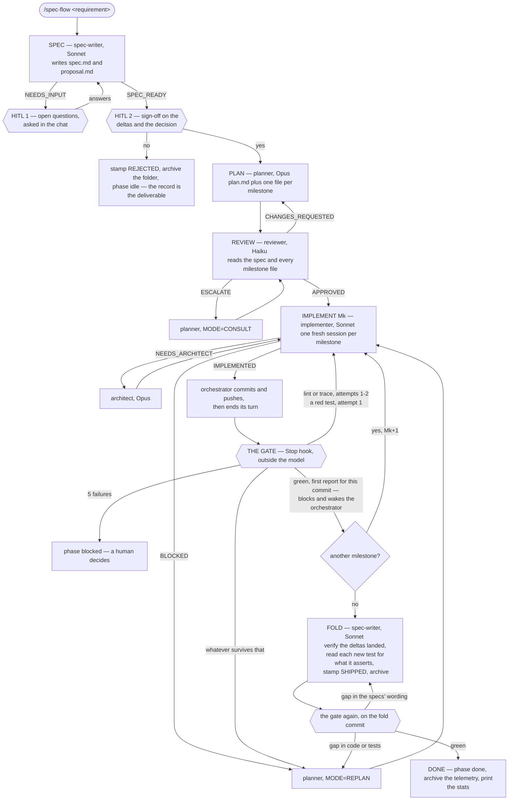
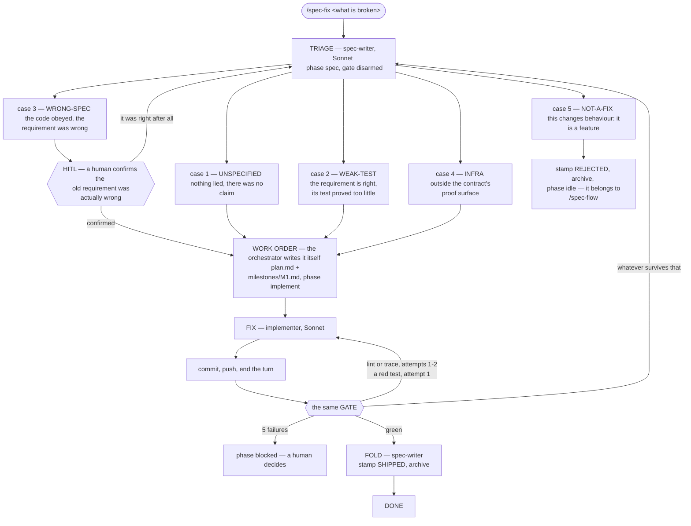
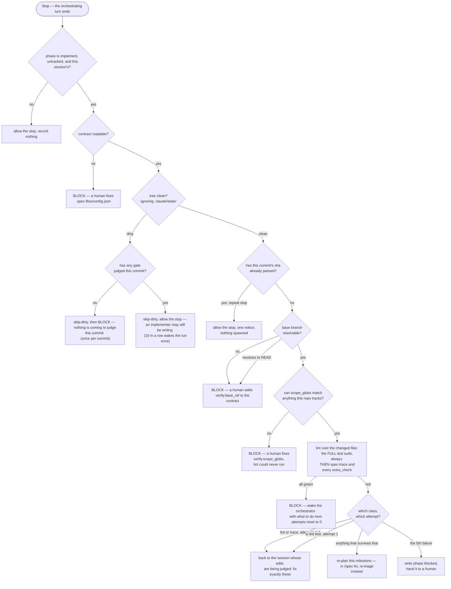

# Reference

Look-up material. For what spec-flow is and how to install it, see the
[README](README.md). The reasoning behind each rule is in
[`decisions/`](decisions/README.md).

- [The contract](#the-contract) — every field of `.spec-flow/config.json`
- [Four rules the contract cannot express](#four-rules-the-contract-cannot-express)
- [The base branch](#the-base-branch)
- [The second config file](#the-second-config-file)
- [Staying current](#staying-current)
- [Project skills](#project-skills)
- [Commands and agents](#commands-and-agents)
- [CLI](#cli)
- [Hooks](#hooks)
- [Phases](#phases)
- [`.claude/state/`](#claudestate)
- [What an install costs](#what-an-install-costs)
- [How a run unfolds](#how-a-run-unfolds) — the three flowcharts

---

## The contract

Everything the engine knows about your repo, at `.spec-flow/config.json`.
Missing or malformed stops the run with a message naming what to add; nothing
guesses a runner or a directory. `spec-flow init` generates it and reports what
it could not determine. To see it as the engine reads it:

```bash
node <plugin-or-clone>/scripts/spec-flow-config.mjs
```

### `verify`

| key | required | what it is |
|---|---|---|
| `scope_globs` | yes | Which files count as in scope, e.g. `["*.ts"]`. **git pathspecs**: `*` already crosses `/`, so `"*.ts"` covers every depth. `**` is refused — `"**/*.ts"` would drop the repo root |
| `lint` | yes | argv that lints, autofix on. Changed file paths are appended |
| `lint_no_fix` | yes | Same, report only (`spec-flow check --no-fix`) |
| `test` | yes | argv that runs the whole suite, with **no** extra arguments |
| `test_name` | yes | Names the runner in log sections, e.g. `"vitest"` |
| `lint_name` | yes | Names the linter in log sections |
| `lint_config_hint` | yes | Where your lint rules live, quoted back when a rule fires |
| `base_ref` | no | The ref this branch is judged against. Omit to auto-resolve |

A pattern that matches nothing the repo tracks blocks the gate as `fail:scope`,
since lint could then never run.

### `trace`

| key | required | what it is |
|---|---|---|
| `specs_dir` | no | Where capability specs live. Default `specs` |
| `report` | no | `{format, path}` of the report your suite writes; `format` is `junit` or `tap` |
| `executed_tests` | no | argv printing the tests that RAN, one per line. The alternative to `report` |
| `proof_dir` | yes | Where a new test goes, e.g. `test` — guidance for the agents, not what counts as proof |
| `proof_suffix` | yes | What a test file is called, e.g. `.test.ts` |
| `not_a_capability` | no | Files under `specs_dir` that are not specs. Default `["README.md", "glossary.md"]` |
| `require_skills_field` | no | Fail a live milestone with no `Skills:` field. Default `false` |

#### What makes a requirement proven

A requirement is proven when a test **that ran** reports a name containing its
id. Declare one source, not both.

- **`report`** (the default): add your runner's reporter flag to `verify.test`
  and name the file. The engine parses JUnit XML and TAP itself —
  `<skipped/>`, `# SKIP` and `# TODO` say a test did not count, whoever wrote
  the file ([ADR-005](decisions/005-a-report-format-is-not-a-runner.md)). `init`
  proposes the flag for the Node runners it knows
  ([ADR-007](decisions/007-the-supported-scope-is-node.md)). The gate and
  `spec-flow check` remove the previous report before each suite, so a suite
  that stops writing it is refused, never judged by the last run's file.
- **`executed_tests`** (the escape hatch, for a runner with no standard
  report): `spec-flow init --translator` scaffolds
  `.spec-flow/tests-that-ran.mjs` with one marked hole; it exits non-zero until
  filled and is never overwritten.

Rules either way:

- **Names carry the id.** `describe > REQ-USER-001_rejects` and
  `test_REQ_USER_001_rejects` both bind (`_` is read as `-`); `REQ-USER-0011`
  never reads as `REQ-USER-001`.
- **A test that did not run is not proof.** `it.skip`, `test.todo`,
  `describe.skip`, a `--grep` that leaves it out and a runtime `t.skip()` all
  end absent from the report.
- **The body is not checked.** A test with the id and no assertion passes the
  gate; the engine reads no source
  ([ADR-020](decisions/020-a-tagged-test-is-judged-not-measured.md)).
  `MODE=FOLD` reads each new requirement's test once per change and reports weak
  ones on its `GAPS:` line, without gating.
- **Nothing to prove, nothing checked.** With no source declared, or a report
  not written yet, `spec-trace` says so and passes — until a requirement
  exists, when an unreadable source is refused.
- **An empty `specs_dir` passes until the first `SHIPPED` change** that names a
  requirement; after that it fails, because the fold claimed its deltas landed
  there.

`spec-trace` separates a report never written, a report holding nothing, a
report whose every case was skipped, and a requirement with no test. Run
`spec-flow check`, which runs your suite first; `spec-flow trace` alone reads
whatever the last run left.

### Writing a capability spec

`init` writes these rules into `specs/README.md`:

```markdown
<!-- spec-scope: modules/user -->

# User

### REQ-USER-001 — the user can reset their password by email

The system sends a single-use link, valid for one hour.
```

- The id prefix comes from the filename: `specs/user-profile.md` declares
  `REQ-USER-PROFILE-`.
- Exactly three digits. Ids are permanent — never renumbered or reused.
- The scope marker is required. Requirements are `###` headings, id first.

### Declaring a delta

A change spec declares what it does to `specs/`. `ADDED` fails when the new id
has no test that ran; `REMOVED` fails when a test still reports an id no spec
declares. A claim that appears, disappears or changes is `REMOVED` + `ADDED` on
a new id. `CHANGED` is only for edits that move no proof, and names which
([ADR-009](decisions/009-a-changed-delta-says-which-kind-it-is.md)):

```markdown
- CHANGED REQ-USER-001 (wording)    — means what it meant; the text is clearer
- CHANGED REQ-USER-001 (correction) — was wrong; now matches behaviour that
                                      already exists and is already proven
```

`(correction)` is legal only in a `/spec-fix` brief (case 3).

### `extra_checks`

Your own checks, run at every gate and again at `done`.

| key | required | what it is |
|---|---|---|
| `name` | yes | Shown in gate output |
| `cmd` | yes | argv, e.g. `["node", "scripts/my-check.mjs"]` |
| `field` | yes | The key it writes in `gate-history.log` |
| `green` | no | Line printed when it passes |
| `hint` | no | Appended to the block message when it fails |
| `class` | no | `"lint/trace"` (route as an edit, default) or `"behaviour"` (route as a re-plan) |

A `cmd` naming a repo-local script that does not exist yet is skipped, not
failed.

### `unscoped_denied`

What is redirected when an agent runs the whole suite mid-milestone. A
consistency guard for context size, not a security boundary.

| key | what it is |
|---|---|
| `scripts` | Package scripts denied while implementing, e.g. `["test", "lint"]` |
| `tools` | Binaries denied directly, e.g. `["vitest", "eslint"]` |
| `scoped_allowed` | Scripts that stay allowed, e.g. `["check"]` |
| `scoped_alternative` | What to run instead, quoted in the denial |
| `scoped_examples` | Concrete allowed invocations, shown in the denial |

---

## Four rules the contract cannot express

- **Gitignore `.claude/state/`.** Tracked, the tree is never clean and the gate
  skips every run after the first. A *committed* `phase` reads as no phase at
  all, so a cloned repo cannot arm the engine
  ([ADR-017](decisions/017-a-repository-does-not-get-to-arm-this-engine.md)).
- **No `--passWithNoTests`** (or equivalent) in `verify.test`: it turns a run
  that matched nothing into a green one.
- **`verify.test` finishes inside 1800s.** A Stop hook that times out is
  cancelled, and a cancelled Stop hook allows the stop. The gate writes
  `result=running` first, so the next gate finds the survivor, records
  `fail:killed` and blocks once. Declare a smoke subset if your suite is slower
  ([ADR-008](decisions/008-the-suite-is-never-scoped-to-the-diff.md)).
- **Work on a branch off your base.** Scope is the diff against the base; work
  committed onto the base branch has an empty diff, so the gate blocks as
  `fail:base` rather than let lint sit out the run.

---

## The base branch

Resolved in order: `verify.base_ref`, `refs/remotes/origin/HEAD`, then
`origin/main`, `main`, `origin/master`, `master`, `origin/develop`, `develop`,
`origin/trunk`, `trunk`.

None resolves → `preflight` refuses the run, and the gate blocks one already
underway. Resolves to **HEAD itself** → only the gate blocks (a fresh feature
branch sits at its base until its first commit, so `preflight` cannot tell).
There is no fallback: comparing HEAD with itself is indistinguishable from
"nothing changed". Declare `base_ref` for a release branch, a fork, or a
shallow CI checkout. Both refusals write `fail:base`; `files=-` means the base
could not be named, `files=0` means it resolved to HEAD.

---

## The second config file

`.claude/spec-flow.config.json` — preferences, not facts about the repo:

```json
{ "max_opus_calls": 6, "agents": { "reviewer": "sonnet" } }
```

- **`max_opus_calls`** (default 6) caps planner + architect calls per run, by
  role, whatever tier they run on. Past it the spawn is denied and the
  orchestrator summarises for a human. Counter: `.claude/state/opus_calls`.
- **`agents`** re-routes an agent to a tier: `opus`, `sonnet`, `haiku` or
  `fable`. A hook applies it to the spawn; an unknown agent or tier denies the
  spawn ([ADR-014](decisions/014-a-project-routes-tiers-not-versions.md)).
- **No `effort`**: a spawn discards it silently. Three agents declare their own;
  the other two take the session's `effortLevel`
  ([ADR-015](decisions/015-effort-is-declared-where-the-role-is-emphatic.md)).
- **A concrete model version** is session-wide, set in the project's
  `.claude/settings.json` as `{"env": {"ANTHROPIC_DEFAULT_OPUS_MODEL": "<id>"}}`
  ([ADR-013](decisions/013-an-agent-names-a-tier-not-a-version.md)).

`spec-flow models` prints what each agent will run on and which layer decided
it, through the same code the spawn hook uses. None of this resets between
conversations; only `/model` and session-only effort do.

---

## Versions

- **Node** — a floor, enforced: `preflight` refuses a run below
  `package.json`'s `engines.node`, inside a run only.
- **Claude Code** — recorded, not checked: `cc=` on every gate-history line
  ([ADR-004](decisions/004-versions-checked-versus-recorded.md)).
- **The engine** — `engine=` on the same line: the commit of the copy that
  judged, or `v<version>` when no commit resolves
  ([ADR-018](decisions/018-the-engine-records-a-revision-not-a-version.md)).

## Staying current

Neither `plugin.json` nor the marketplace entry declares a `version`, so Claude
Code falls through to the git SHA and every push to `main` is an update
([ADR-003](decisions/003-no-plugin-version-field.md)). Run
`/plugin marketplace update`, or turn on background auto-update, which is off by
default for third-party marketplaces — per install under `/plugin` →
**Marketplaces**, or for a repo in its `.claude/settings.json`:

```json
{
  "extraKnownMarketplaces": {
    "spec-flow-marketplace": {
      "source": { "source": "github", "repo": "IgnacioMarin402/spec-flow-plugin" },
      "autoUpdate": true
    }
  }
}
```

That entry needs this folder trusted (not a parent), registers the marketplace
without installing the plugin, and is replaced whole by a higher-precedence
file defining the same name. A headless `claude -p` session never uses it.

The optional devDependency does not follow: it is a git spec and moves when you
move it. Nothing detects the two halves on different commits
([ADR-016](decisions/016-one-repository-one-distribution.md)).

---

## Project skills

Claude Code already lists every skill's name and description to the agents, and
this plugin adds no index. The agents ship with no `skills:` frontmatter — which
skills exist is your codebase's business — and `planner` and `implementer`
carry the `Skill` tool.

The routing happens at plan time: each `milestones/Mk.md` has a `Skills:` field
the planner fills (`none` when nothing applies), and the implementer loads what
it names **before its first edit**. The reviewer checks the field;
`spec-trace` fails a missing one only with `trace.require_skills_field: true`,
which cannot be inferred because skills also arrive from plugins and from
`~/.claude/skills/`.

To preload instead, add your own `.claude/agents/implementer.md` with a
`skills:` line: a project agent outranks a plugin's.

---

## Commands and agents

| | |
|---|---|
| `/spec-flow <requirement>` | Full pipeline: spec, plan, review, implement, fold |
| `/spec-fix <what's broken>` | Defect flow: triage, one implementer pass, same gate |
| `/spec-flow:models` | Which tier each agent runs on and who decided. `<agent> <tier>` sets one, `<agent> default` clears it |
| agents | `spec-writer` (Sonnet), `planner` (Opus, effort high), `reviewer` (Haiku, effort low), `implementer` (Sonnet), `architect` (Opus, effort high) — shipped defaults |

---

## CLI

| command | what it does |
|---|---|
| `spec-flow init` | Generate `.spec-flow/config.json` and scaffold. `--force` to overwrite |
| `spec-flow check` | Lint changed files + full suite + unscoped checks. `--no-fix` to report only |
| `spec-flow trace` | `spec-trace` alone |
| `spec-flow stats` | Report over live and archived telemetry. `--raw` dumps the timeline |
| `spec-flow status` | Where the live run is, what the gate last said, what it has cost |
| `spec-flow models` | Which tier each agent runs on here, and which layer decided it |
| `spec-flow telemetry --mark` | Record the telemetry offset at the start of a run |
| `spec-flow telemetry <SLUG>` | Archive this run's slice into the change folder |

**Inside a session none of this is needed**: every hook, command and agent
resolves through `${CLAUDE_PLUGIN_ROOT}`. The CLI is for a terminal without
Claude Code and for CI.

The short `spec-flow` name exists once the optional devDependency is installed:
`npm install --save-dev github:IgnacioMarin402/spec-flow-plugin#<commit-or-tag>`.
Nothing is published to npm, and `spec-flow` on npm is an unrelated package.
Without it, run the same scripts by path, from your repo's root:

| `spec-flow …` | by path |
|---|---|
| `init` | `node <clone>/scripts/init.mjs` |
| `check` | `node <clone>/scripts/check-changed.mjs` |
| `trace` | `node <clone>/scripts/spec-trace.mjs` |
| `stats` | `node <clone>/scripts/specflow-stats.mjs` |
| `telemetry` | `node <clone>/scripts/telemetry-snapshot.mjs` |

`<clone>` can be the installed plugin's own directory — the copy the gate runs.

---

## Hooks

| hook | event | fires on | what it does |
|---|---|---|---|
| `session-start` | `SessionStart` | — | Resets a run phase untouched for 6h+ to `idle` |
| `preflight` | `PreToolUse` | `Task`, `Agent`, `SendMessage` | Refuses a run whose contract does not load, whose base does not resolve, or whose Node is below the floor |
| `no-gate-cmds` | `PreToolUse` | `Bash` | Denies whole-repo lint/test runs while implementing |
| `phase-guard` | `PreToolUse` | `Bash`, `Write`, `Edit` | Denies a phase outside the closed set, and an unearned `done` |
| `opus-budget` | `PreToolUse` | `Task`, `Agent`, `SendMessage` | Counts planner/architect calls, denies past the cap |
| `arm-gate` | `PreToolUse` | `Task`, `Agent`, `SendMessage` | Writes `implement` when the implementer is engaged without it |
| `model-route` | `PreToolUse` | `Task`, `Agent` | Applies the project's `agents` routing to the spawn |
| `lint-on-write` | `PostToolUse` | `Write`, `Edit` | Lints the file just written |
| `register-agent` | `PostToolUse` | `Task`, `Agent` | Maps session ids to agent types, so a `SendMessage` can be charged |
| `run-trace` | `PostToolUse` | `Write`, `Edit`, `Read`, `Bash`, `Task`, `Agent` | The run's timeline. Enforces nothing |
| `token-trace` | `Stop` | — | Token accounting from the session transcript. Enforces nothing |
| `gate` | `Stop` | — | The external gate. The only hook that fails closed |

`gate`, `lint-on-write` and `no-gate-cmds` arm only on `implement`.
`preflight`, `opus-budget`, `arm-gate` and `phase-guard` stand down outside a
run. `model-route` applies whenever a project routes. Every hook but the gate
fails open on its own crash.

---

## Phases

`.claude/state/phase` is the spine: every hook reads it to decide whether it is
armed.

| phase | written by | arms |
|---|---|---|
| `spec`, `plan`, `review` | orchestrator | `preflight`, Opus budget, `phase-guard`, `arm-gate` |
| `implement` | orchestrator, or `arm-gate` if it forgot | **the gate**, **lint-on-write**, **the command deny**, plus the above |
| `blocked` | **the gate**, at the attempt cap | `preflight`, Opus budget, `phase-guard`, `arm-gate` |
| `done` | orchestrator, if `phase-guard` allows | nothing |
| `idle` | orchestrator on rejection; `session-start` on an abandoned run | nothing |

- **The vocabulary is closed.** Any other value would disarm every hook at
  once, so `phase-guard` denies it.
- **`done` is earned**: every unscoped check green and no unarchived
  `specflow/<SLUG>/`.
- **A phase belongs to one session.** `phase-guard` records the writer in
  `.claude/state/phase.session`; the gate and the Opus budget ignore a phase
  sealed by another session. Both checks fail closed
  ([ADR-017](decisions/017-a-repository-does-not-get-to-arm-this-engine.md)).
- **To stand a run down yourself**: `printf 'idle' > .claude/state/phase`.

---

## `.claude/state/`

Gitignored working files; delete one to reset that piece of state.

| file | what it holds |
|---|---|
| `phase` / `phase.session` | The current phase, and the session that owns it |
| `gate_attempts` | Consecutive gate failures. Reset on pass, capped at 5 |
| `opus_calls` | Planner + architect calls this run |
| `gate-history.log` | One line per gate invocation; a surviving `running` line means that invocation was killed |
| `gate-failure.log` / `.full.log` | Last failure, truncated for the planner / whole for a human |
| `run-trace.log` | Reads, writes, test verdicts, subagent outcomes, token counts |
| `run-offset` / `token-offset` | Where this run's telemetry starts / how far the token accounting has read |
| `agent-registry` | Session id → agent type |
| `model-routes.log` | One line per re-routed agent |
| `*-unmatched.log` | What each hook could not read — how a hook that fails open reports its blind spots |

---

## What an install costs

Measured on `10bfbdf` with `claude plugin details spec-flow`, after a real
install; a dated observation, not a standing claim. The hooks cost no model
context — the checks run outside the model.

```
Always-on:   ~580 tok   added to every session

  component    always-on  on-invoke
  architect          ~80       ~600
  planner            ~80      ~3.5k
  spec-writer       ~140      ~5.7k
  reviewer           ~50      ~1.3k
  implementer       ~100      ~3.8k
  spec-fix           ~60      ~5.2k
  spec-flow          ~60      ~5.6k
```

---

## How a run unfolds

Nothing coordinates a run but `.claude/state/phase`. A subagent finishes, the
orchestrator's turn ends, and the `Stop` hook runs the checks outside the model
and either allows the stop or blocks with the next instruction. The
orchestrator never writes code; the gate's block message *is* the next step.

### `/spec-flow` — a feature


```mermaid
flowchart TD
    A(["/spec-flow &lt;requirement&gt;"]) --> B["SPEC — spec-writer, Sonnet <br/> writes spec.md and proposal.md"]
    B -->|"NEEDS_INPUT"| Q{{"HITL 1 — open questions, <br/> asked in the chat"}}
    Q -->|"answers"| B
    B -->|"SPEC_READY"| S{{"HITL 2 — sign-off on the <br/> deltas and the decision"}}
    S -->|"no"| REJ["stamp REJECTED, archive the folder, <br/> phase idle — the record is the deliverable"]
    S -->|"yes"| P["PLAN — planner, Opus <br/> plan.md plus one file per milestone"]
    P --> R["REVIEW — reviewer, Haiku <br/> reads the spec and every milestone file"]
    R -->|"ESCALATE"| CON["planner, MODE=CONSULT"]
    CON --> R
    R -->|"CHANGES_REQUESTED"| P
    R -->|"APPROVED"| I["IMPLEMENT Mk — implementer, Sonnet <br/> one fresh session per milestone"]
    I -->|"NEEDS_ARCHITECT"| ARCH["architect, Opus"]
    ARCH --> I
    I -->|"BLOCKED"| RE["planner, MODE=REPLAN"]
    RE --> I
    I -->|"IMPLEMENTED"| CM["orchestrator commits and pushes, <br/> then ends its turn"]
    CM --> G{{"THE GATE — Stop hook, outside the model"}}
    G -->|"lint or trace, attempts 1-2 <br/> a red test, attempt 1"| I
    G -->|"whatever survives that"| RE
    G -->|"5 failures"| BLK["phase blocked — a human decides"]
    G -->|"green, first report for this commit — <br/> blocks and wakes the orchestrator"| MORE{"another milestone?"}
    MORE -->|"yes, Mk+1"| I
    MORE -->|"no"| F["FOLD — spec-writer, Sonnet <br/> verify the deltas landed, <br/> read each new test for what it asserts, <br/> stamp SHIPPED, archive"]
    F --> G2{{"the gate again, on the fold commit"}}
    G2 -->|"gap in the specs' wording"| F
    G2 -->|"gap in code or tests"| RE
    G2 -->|"green"| D["DONE — phase done, <br/> archive the telemetry, print the stats"]
```

A milestone gets a **fresh** implementer session; every retry within it goes
back to the *same* session, because re-reading from a cold context is where
most of a run's tokens go.

### `/spec-fix` — a defect

A defect is a closed question — which side is wrong, the code or its
requirement — so this flow triages instead of planning, and drops the planner
and the reviewer.


```mermaid
flowchart TD
    A(["/spec-fix &lt;what is broken&gt;"]) --> T["TRIAGE — spec-writer, Sonnet <br/> phase spec, gate disarmed"]
    T --> C1["case 1 — UNSPECIFIED <br/> nothing lied, there was no claim"]
    T --> C2["case 2 — WEAK-TEST <br/> the requirement is right, <br/> its test proved too little"]
    T --> C3["case 3 — WRONG-SPEC <br/> the code obeyed, the requirement was wrong"]
    T --> C4["case 4 — INFRA <br/> outside the contract's proof surface"]
    T --> C5["case 5 — NOT-A-FIX <br/> this changes behaviour: it is a feature"]
    C3 --> H{{"HITL — a human confirms the <br/> old requirement was actually wrong"}}
    C5 --> REJ["stamp REJECTED, archive, <br/> phase idle — it belongs to /spec-flow"]
    H -->|"confirmed"| W
    H -->|"it was right after all"| T
    C1 --> W
    C2 --> W
    C4 --> W
    W["WORK ORDER — the orchestrator writes it itself <br/> plan.md + milestones/M1.md, phase implement"]
    W --> I["FIX — implementer, Sonnet"]
    I --> CM["commit, push, end the turn"]
    CM --> G{{"the same GATE"}}
    G -->|"lint or trace, attempts 1-2 <br/> a red test, attempt 1"| I
    G -->|"whatever survives that"| T
    G -->|"5 failures"| BLK["phase blocked — a human decides"]
    G -->|"green"| F["FOLD — spec-writer <br/> stamp SHIPPED, archive"]
    F --> D["DONE"]
```

Only cases 3 and 5 stop for a human: a diff cannot tell a requirement rewritten
to match the code from one rewritten to match the bug.

### The gate


```mermaid
flowchart TD
    S(["Stop — the orchestrating turn ends"]) --> P{"phase is implement, <br/> untracked, and this session's?"}
    P -->|"no"| ALLOW["allow the stop, record nothing"]
    P -->|"yes"| CFG{"contract readable?"}
    CFG -->|"no"| BLK1["BLOCK — a human fixes <br/> .spec-flow/config.json"]
    CFG -->|"yes"| DIRTY{"tree clean? <br/> ignoring .claude/state/"}
    DIRTY -->|"dirty"| JUDGED{"has any gate <br/> judged this commit?"}
    JUDGED -->|"no"| WAKE["skip-dirty, then BLOCK — <br/> nothing is coming to judge this commit <br/> (once per commit)"]
    JUDGED -->|"yes"| SKIP["skip-dirty, allow the stop — <br/> an implementer may still be writing <br/> (10 in a row wakes the run once)"]
    DIRTY -->|"clean"| SEEN{"has this commit's sha <br/> already passed?"}
    SEEN -->|"yes, repeat stop"| QUIET["allow the stop, one notice, <br/> nothing spawned"]
    SEEN -->|"no"| BASE{"base branch <br/> resolvable?"}
    BASE -->|"no"| BLK2["BLOCK — a human adds <br/> verify.base_ref to the contract"]
    BASE -->|"resolves to HEAD"| BLK2
    BASE -->|"yes"| SCOPE{"can scope_globs match <br/> anything this repo tracks?"}
    SCOPE -->|"no"| BLK3["BLOCK — a human fixes <br/> verify.scope_globs. <br/> lint could never run"]
    SCOPE -->|"yes"| RUN["lint over the changed files <br/> the FULL test suite, always <br/> THEN spec-trace and every extra_check"]
    RUN -->|"all green"| PASS["BLOCK — wake the orchestrator <br/> with what to do next. <br/> attempts reset to 0"]
    RUN -->|"red"| CLS{"which class, <br/> which attempt?"}
    CLS -->|"lint or trace, attempts 1-2"| FIX["back to the session whose edits <br/> are being judged: fix exactly these"]
    CLS -->|"a red test, attempt 1"| FIX
    CLS -->|"anything that survives that"| REPLAN["re-plan this milestone — <br/> in /spec-fix, re-triage instead"]
    CLS -->|"the 5th failure"| CAP["write phase blocked, <br/> hand it to a human"]
```

- **A dirty tree is not judged** — a background implementer may be mid-write —
  but it wakes the run once on a commit no gate has judged, and after ten
  dirty stops in a row ([ADR-012](decisions/012-a-dirty-tree-on-an-unjudged-commit-wakes-the-run.md)).
- **spec-trace runs after the suite**, so it judges this run's report.
- **Lint is scoped to the changed files; the suite never is**, not even on an
  empty scope ([ADR-008](decisions/008-the-suite-is-never-scoped-to-the-diff.md)).
- **A pass blocks once per commit**, not once per stop
  ([ADR-010](decisions/010-a-green-gate-wakes-the-run.md)).
- **The failure class decides the route**: a traceability gap is usually a test
  that never named its requirement — an edit, not a re-plan.
- **It fails closed**: an unhandled throw blocks, because a Stop hook that
  prints nothing allows the stop.
